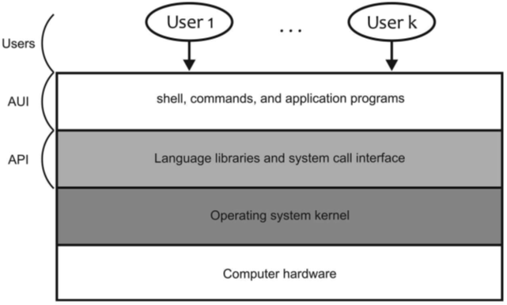
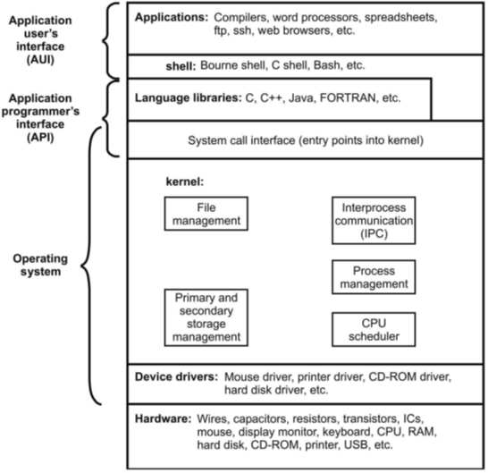
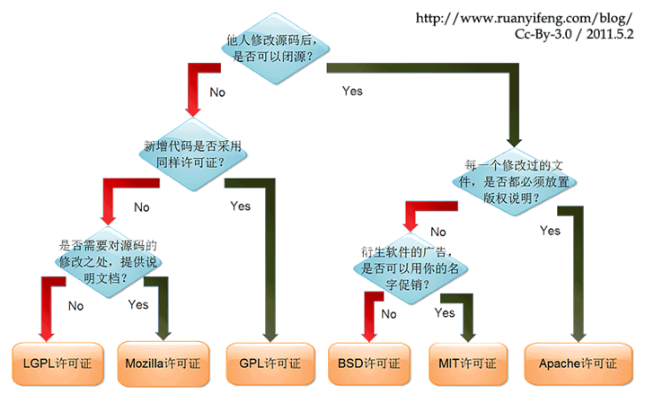

# Lecture 1 Linux Introduction

## 1.1 What Is an Operation System

- `API` ：提供给程序员编写软件的接口
- `AUI`：编写好的各种软件
- Operating System ：以有效、公平、有序的方式分配上层所需的资源。屏蔽了一些复杂硬件资源使用的接口，不用关心底层。 

## 1.2 Linux Operation System

- hard drivers : 驱动程序，由操作系统打包，驱动硬件
- kernel：操作系统内核，执行文件管理，存储管理，进程管理，进程通信（管道、匿名管道、socket？），CPU调度
- System Call Interface：系统调用接口，规定了申请内存资源的调用方式
- Language libraries：库函数
- 两类 AUI
    - Command User Interface : CUI 
    - Graphical User Interface : GUI  

## 1.3 Free Software & Open source

- GPL(GNU Public License)
    - access source code
    - copy
    - modify
    - redistribute

- Other License
    - [BSD, Apache, LGPL, MIT](http://oss.org.cn/?action-viewnews-itemid-53184)

- Freeware & Shareware

## 1.4 Variations in Linux

- Linux distribution: Redhat, Slackware, Debian, Mandrake, Suse, Redflag, Gentoo, Bluepoint,Ubuntu,Centos, Knoppix

Linux 发行版本 $\to$ 使用的内核相同，区别在于周围的东西不同（驱动程序、`Xwindow` 图形界面接口、`deb / rbm` 不同格式的安装包）

**[Which Distro Should I Choose?](https://www.linuxtrainingacademy.com/distros/)**

Redhat ( 收费 ) / Ubuntu

## 1.5 Linux System Standardization

- Portable Operation System Interface (POSIX)

- Single UNIX Specification (SUS)

- Linux Standard Base (LSB)