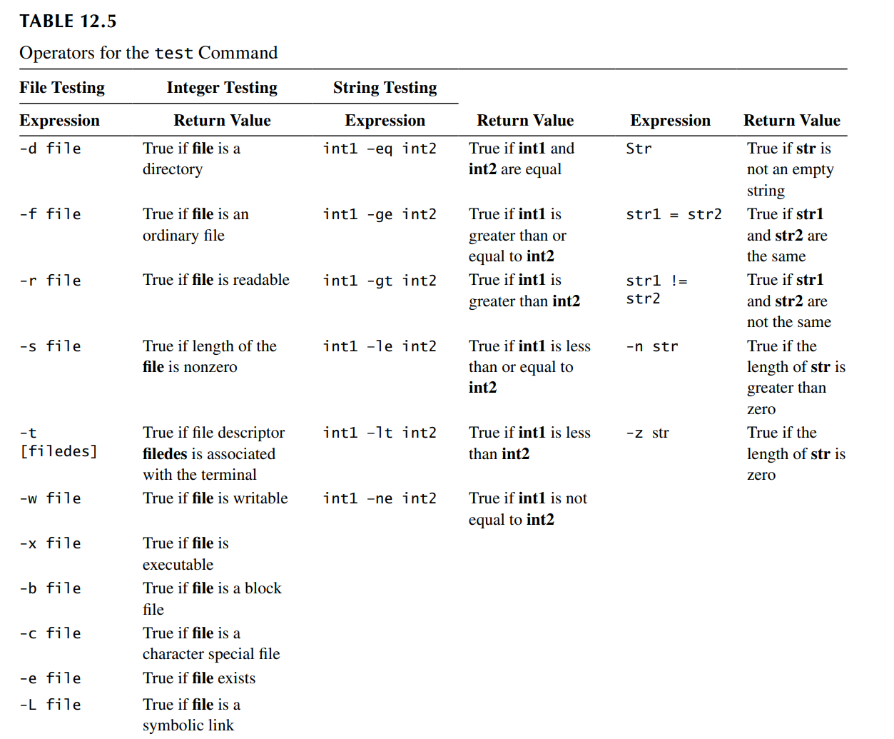
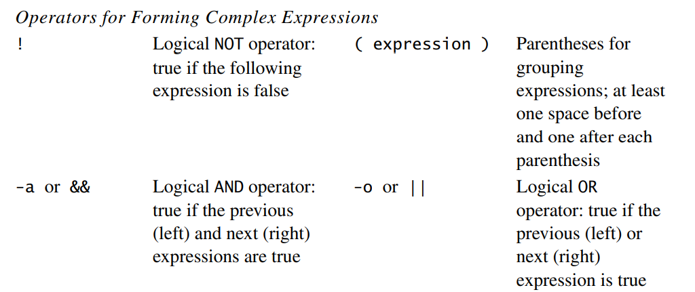

# Lecture 10 Bourne Shell Programming

## 10.1 Running a Bourne Shell Script

Ways of running a Bourne Shell

- Make the script file executable by adding the execute permission to the existing access permissions for the file
    - 给文件一个执行权限

```
chmod u+x script_file
```

- Run the `/bin/sh` command with the script file as its parameter
    - 让它在子进程 shell 里面运行

```
/bin/bash script_file
```

- Run the source or `.`  command with the script file as its parameter
    - 在当前 shell 中执行

```
/bin/source script_file
```

- Force the current shell to execute a script in the Bourne shell, regardless of your current shell
    - 当语法shell的当前运行的shell不一致的时候，添加命令使用另外的程序对它解释执行

```
#!/bin/bash //当在解释这个文件的时候，当在创建这个子进程对脚本解释执行的时候，替换文件的语法shell对脚本解释执行
```

## 10.2 Shell Variables

- 通过等号赋值
    - 等号两端不能有空格
- 通过 `$` 访问

```
s193157@GOJ:/tmp$ name='tom'
s193157@GOJ:/tmp$ echo $name
tom
s193157@GOJ:/tmp$ a=$name
s193157@GOJ:/tmp$ echo $a
tom
```

- 子进程可以继承父进程的环境变量
    - 使用 `env` 查看环境变量
    - 当创建子进程的时候，子进程将所有环境变量**复制**一份
    - 子进程如果修改了环境变量的值，不会影响的父进程
    - 让脚本在当前shell执行
    - ！`PATH`：去哪些目录去找可执行文件

- 使用 `export` 创建环境变量

```
s193157@GOJ:/tmp$ export name
```

## 10.3 Read-only Shell Variables

- `$0` ：可执行的脚本的文件的文件名
- `$1-9`：可执行文件的参数
- `$*/$@`：显示所有的参数
    - 区别：用`""` 引起来的时候
        - `$*`：表示 `"a b c"`
        - `$@`：表示 `"a" "b" "c"`

- `$#`：代表参数的个数

- `$$`：代表当前执行脚本的进程 `id`

- `$?`：上一条命令的返回状态
    - 可以使用 `$?` 判断语句的执行是否成功

- `$!`：刚刚切换到后台的变量

- 默认变量是字符串

```
s193157@GOJ:/tmp$ a=1
s193157@GOJ:/tmp$ a=$a+1
s193157@GOJ:/tmp$ echo $a
1+1
```

- 以数值进行运算

```
s193157@GOJ:/tmp$ declare -i a
s193157@GOJ:/tmp$ a=4
s193157@GOJ:/tmp$ a=$a+1
s193157@GOJ:/tmp$ echo $a
5
```

## 10.4 Command Substitution

```
s193157@GOJ:~$ num=`who | wc -l`
s193157@GOJ:~$ num=$(who | wc -l)
```

## 10.5 Resetting Variables

	unset [name-list]

**Purpose**  Reset or remove the variable or function corresponding to the names in ‘name-list’, where ‘name-list’ is a list of names separated by spaces

## 10.6 Creating Read-Only Defined Variables

	readonly [name-list]

**Purpose**  Prevent assignment of new values to the variables in ‘name-list’

```
s193157@GOJ:~$ name='tom'
s193157@GOJ:~$ name='jack'
s193157@GOJ:~$ readonly name
s193157@GOJ:~$ name='tom'
-bash: name: 只读变量
```

## 10.7 Reading from Standard Input

```
read variable-list
```

 **Purpose** Read one line from standard input and assign words in the line to variables in ‘name-list’

```
nano hello.sh

read -p 'Please input two names:' name1 name2
echo "Hello, $name1"
echo "Hello, $name2"
```

- read 在输入赋值的时候，如果是最后一个变量，将没有赋值的字符串直接赋值给最后一个变量

## 10.8 Special Characters for the echo Command

- 转义字符只有加上 `-e` 才可以识别转义字符

```
s193157@GOJ:~$ echo -e "tom\tjack"
tom     jack
```

- echo语句不换行使用 `-n` 语句

## 10.9 Operators for the `test` Command





