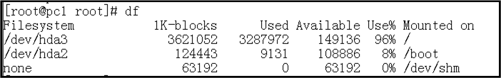
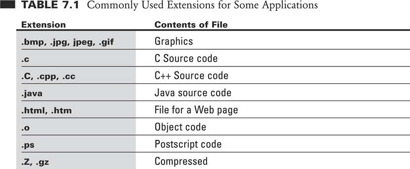
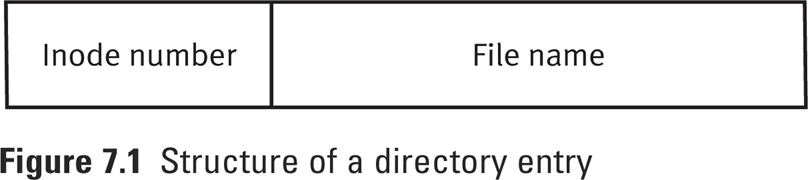
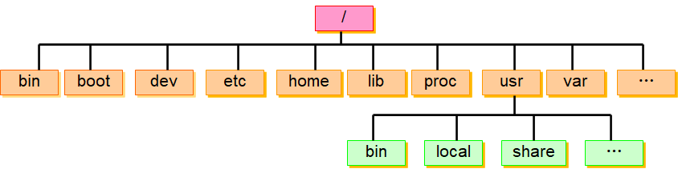
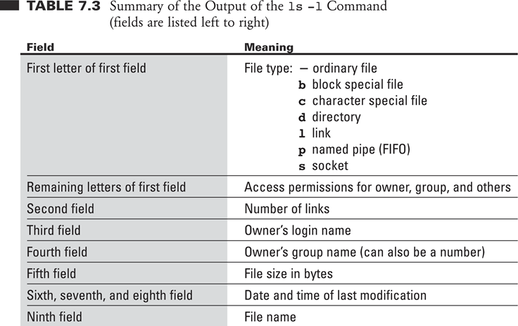

# Lecture 4 File System

## 4.1 Unix devices

在 Linux 中，设备也看作文件

| Device              | ID in Unix                     |
| ------------------- | ------------------------------ |
| SCSI/SATA Hard Disk | `/dev/sd[a-p]  `               |
| USB Disk            | `/dev/sd[a-p](same as SCSI)  ` |
| CDROM               | `/dev/cdrom`                   |
| Printer             | `/dev/lp[0-2]`                 |
| Mouse               | `/dev/mouse`                   |

e.g. 第一块 SATA 硬盘   `/dev/sda`  第二块 SATA 硬盘  `/dev/sdb` 第一块u盘  `/dev/sdc`

## 4.2 Hard Disk

在 Linux 中，使用目录来进行分区



- `mounted on` 就类似于 Windows 中的盘符，对 Linux 下的文件系统进行分区，优先找映射过的分区

## 4.3 File System Mount

- 在安装 Linux 时，自动创建三个分区
    - `/` 根目录，存放大部分文件
    - `swap` 虚拟内存分区
    - ` /boot`  系统启动文件
- Linux 不关心文件的扩展名，文件能否运行取决于它所拥有的权限

## 4.4 Make the File System Work

Linux 最多生成 4 个分区，分区有两种类型

- 主分区
- 扩展分区：对于一个分区，可以设置一个分区为扩展分区，扩展分区中可以设置逻辑分区

### 4.4.1 Disk Partition（分区）: `parted`

### 4.4.2 Format the partition（格式化）: `mkfs`  

文件系统格式：`ext2，ext3，ext4，xfs，zfs`

现在最常用：`ext4`

``` 
mkfs -t ext4 /dev/sdb1
```

Mount the disk partition （挂载分区到目录上，使得分区可用）

- 使用 `mount` 创建分区

```
mount [-t vfstype]（可不写） [-o options] device dir
```

比如

```
mount /dev/sdb1 /mnt 
```

- 这样操作后 `/mnt` 就是新硬盘的分区，通过访问 `/mnt` 目录访问文件
- 注意：`sdb1` 中的 $1$ 一定要写，表示这个设备的第一个分区
- `mount` 命令可以查看当前的分区
- 在命令行下输入的挂载命令，只在当前有效，重新登录系统挂载信息消失
    - 将挂载文件写入 `/etc/fstab` 文件中，可以自动挂载
    - `/dev/sdb1 /mnt ext4 defaults（选项） 0（） 1（检查文件完整性）`

### 4.4.3 Uninstall Partition  （卸载分区）：`umount`

输入文件分区名或者挂载的目录均可以卸载分区

```
umount /dev/sdb1
```

或者

```
umount /mnt
```

## 4.5 Types of Files

### 4.5.1 Simple/ordinary file

- Linux 中，不关心文件的扩展名，一个文件是否可以执行，由权限决定



### 4.5.2 Directory File 目录文件

- 目录文件记录了所在目录下的文件信息：文件名，索引节点号



### 4.5.3 Link File 链接文件

保存路径信息，指向另一个文件，类似于快捷方式

### 4.5.4 Special (Device) File 设备文件

- Character Special Files 字符设备文件，以字符为单位传输数据
    - Correspond to character-oriented devices (e.g., Keyboard)
- Block Special Files 以块为单位传输数据
    - Correspond to block-oriented devices (e.g., a disk)

### 4.5.5 Named Pipe (FIFO) 命名管道文件

- 帮助进程通信

- 一个进程往文件中写数据，另一个进程读数据，当一个进程读取过管道文件的数据后，这些在管道的数据被销毁

### 4.5.6 Socket 插口文件

- 帮助网络间的进程通信

## 4.6 Linux directory

使用目录的形式组织文件

Linux 文件系统标准 `directory structure: FHS`



- `bin` ：常用命令
- `sbin` ：系统管理命令
- `boot`：保存启动文件
- `dev`：设备目录
- `ect` ：系统相关的配置文件，配置命令和脚本
- `home`：每个用户的工作目录
- `lib`：程序库
- `proc` ：虚拟目录，保存的是系统的运行信息
- `usr` ：类似于系统应用目录 类似于`windows ProgramFile`
- `var`：存放大小容易变化的文件，比如日志文件

## 4.7 Some commands about files

- Check the storage of system
    - `df`  分区使用情况(分区设备名，分区大小，已用，可用，已用%，挂载点)
        - ` df -h dev/sda1`
        - `du` 查看某个文件使用存储空间的情况

- Manipulate directory
    - `pwd`    ：显示当前目录
    - `cd`   ：返回上一级或者转到某一级目录
    - `mkdir`  
    - `rmdir`  
    - `ls`：列出当前目录下的文件
        - `ls -a` 列出隐藏目录下的文件
        - `ls -l` 列出包含当前目录下所有文件的详细信息

**详细信息的含义**



PS：`du`命令显示的是给文件分配的存储空间， `ls` 显示的文件的实际大小

- Manipulate files
    - `rm`：删除某个目录
    - `cp`：用于拷贝的命令（文件、目录）    
    - `mv`  ：文件、目录的移动，重命名
        - `mv dira dirc`
        - `mv dira \tmp`
    - `file`   
    - `touch`：创建空文件，修改日期为当前时间，如果文件已经存在，会修改文件的最后访问时间
- Check the file system
    - `fsck`

## 4.8 LVM

分区逻辑卷管理，可以跨硬盘创建虚拟分区，对于存储空间变化很大的分区十分有用

**缺点**

- 效率较低，不建议用于 `system` 分区