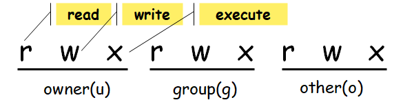

# Lecture 5 File Security

## 5.1 Protection based on Access Permission

- 使用 `id` 或者 `group` 查看用户处于哪个组

**Types of users**

- User (owner), group, others
- A user with multiple groups

**Types of Access Permissions**

- Read, write, and execute（文件能否执行取决于权限）

**Access Permissions for Directories**

- Read: list the files 
- Write: create or remove directories and files
- Execute: Directory search

## 5.2 Determining File Access Privileges

- 文件的九个权限位



-  查看文件权限

```
s193157@GOJ:~$ ls -l /tmp/hello
-rwxrwxr-- 1 test stu 8920 Mar 30 08:59 /tmp/hello
```

> 第一个横杠表示是普通文件
>
> 后面表示是文件的权限

## 5.3 File owner information

- Find the user id
    -  `id user`
- Find the user group
    - `group user`
- Change the file owner
    - `chown`
    - `chgrp`

## 5.4 Changing File Access Privileges

- Changing File Access Privileges

```
chmod [options] symbolic-mode file-list
```

- 增加其他人的目录权限

```
chmod o+w dira/a
```

- 取消其他人和同组用户的读写执行权限

```
chmod -R(对目录里面所有子目录的文件递归执行) og-rwx dira/a
```

- 直接指定文件的访问权限

```
chmod -R u=rwx,g=rx,o= dira/a
或者
chmod -R 750 dira/a
chmod -R 7(111)5(101)0(000) dira/a
```


**注意**

- 只读文件也可以被删除

## 5.5 Default file access privileges

通过掩码值控制文件的默认访问权限
$$
get=777-umask (目录)\\
get=666-umask(文件)
$$

- 每一位分别相减

- 重设 `umask +掩码值` （只对当前登陆有效）
    - 将命令放入 `shell` 启动文件中，可以对每次启动生效
- 不可执行的文件无法设置可执行位

## 5.6 Special Access Bits 特殊访问位

- The Set-User-ID (SUID) Bit
    - 如果为包含命令的可执行程序的文件设置了该位，则该文件在执行时将具有文件所有者的特权

```
chmod 4xxx file-list
chmod u+s file-list
```

- The Set-Group-ID (SGID) Bit
    - 在执行的时候，使文件的访问权限采用文件所有者所属组的组标识

```
chmod 2xxx file-list
chmod g+s file-list
```

- 黏着位 The Sticky Bit
    - 针对目录有效
    - 设定后，各个用户在同一目录下创建的文件就不会被他人删除或者修改

```
chmod 1xxx file-list
chmod +t file-list
```

