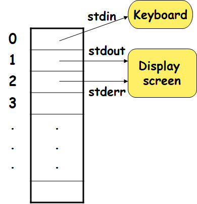
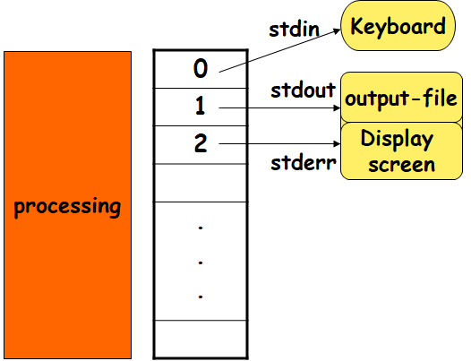
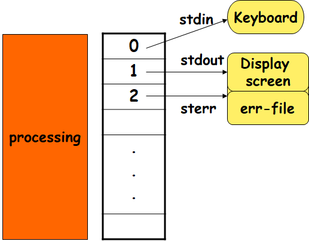
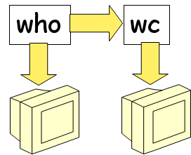

# Lecture 7 Redirection and Piping

## 7.1 Input Redirection



- 0号：标准输入文件
- 1号：标准输出文件
- 2号：标准错误输出文件

## 7.2 Output Redirection

- Use '>' or '>>' for output redirection
    - command > output-file   (overwrite)
    - command >> output-file  (append)



```
重定向标准输入
s193157@GOJ:~$ ./add < a.in //重定向到文件a.in

重定向标准输出
s193157@GOJ:~$ ./add > a.out //重定向到文件a.out
s193157@GOJ:~$ ./add >> a.out //重定向到文件a.out增加
```

## 7.3 Redirecting Standard Error



- 如果没有权限访问一个文件或者产生了错误信息，使用二号文件（标准错误输出文件）输出到屏幕

```
e.g 忽略错误信息
s193157@GOJ:~$ find /tmp -name '*.cpp' 2>result
通常会重定向到 /dev/null文件下 这个文件始终为空
s193157@GOJ:~$ find /tmp -name '*.cpp' 2>/dev/null
```

## 7.4 Redirecting stdin,stdout and stderr in One Command

- Redirecting stdin and stdout in One Command

```
Command < input-file > out-file
```

- Redirecting stdout and stderr in One Command

```
Command > out-file 2>err-file
Command > out-file 2>&1 
//同时重定向到标准输出和标准错误输出
Command >& out-file
```

- example

```
s193157@GOJ:~$ nano input.txt
s193157@GOJ:~$ cat input.txt
200 300
s193157@GOJ:~$ /tmp/add < input.txt > output.txt
s193157@GOJ:~$ cat output.txt
500
```

## 7.5 UNIX Pipes (‘|’)

### 7.5.1 `|`

Used to connect the stdout of one command to the stdin of another command `who | wc`




- 结合多个简单命令，构成一个复杂功能
- `KISS` 原则
    - `K`：keep
    - `I`：It
    - `S`：Simple
    - `S`：Stupid

```
统计登陆到系统的人数
s193157@GOJ:~$ who | wc -l
50

s193157@GOJ:~$ who | awk '/^s19/{print $0}' | awk '/\(192.168/{print $0}'
s192872  pts/1        2021-05-11 15:24 (192.168.207.215)
s192982  pts/9        2021-05-11 15:31 (192.168.207.131)
s192985  pts/14       2021-05-11 15:34 (192.168.207.132)
s193157  pts/15       2021-05-11 15:34 (192.168.207.215)
s192875  pts/17       2021-05-11 15:36 (192.168.207.122)
s193036  pts/18       2021-05-11 15:36 (192.168.207.102)
s193101  pts/22       2021-05-11 15:39 (192.168.207.148)
s192860  pts/23       2021-05-11 15:39 (192.168.207.134)
s193071  pts/30       2021-05-11 16:58 (192.168.207.215)
s192952  pts/32       2021-05-11 16:17 (192.168.207.215)
s192965  pts/33       2021-05-11 16:18 (192.168.207.215)
s192894  pts/36       2021-05-11 16:30 (192.168.207.153)
s193080  pts/37       2021-05-11 16:30 (192.168.207.7)
s193083  pts/38       2021-05-11 16:30 (192.168.207.133)
s192913  pts/39       2021-05-11 16:30 (192.168.207.121)
s193073  pts/40       2021-05-11 16:30 (192.168.207.176)
s192972  pts/42       2021-05-11 16:34 (192.168.207.97)
s192999  pts/43       2021-05-11 16:44 (192.168.207.105)
s192866  pts/46       2021-05-11 16:32 (192.168.207.125)
s192887  pts/47       2021-05-11 16:39 (192.168.207.120)
s192864  pts/51       2021-05-11 16:33 (192.168.207.98)
s192862  pts/53       2021-05-11 16:54 (192.168.207.128)
s193031  pts/54       2021-05-11 16:35 (192.168.207.113)
s193213  pts/6        2021-05-11 16:47 (192.168.207.135)
s193198  pts/57       2021-05-11 16:48 (192.168.207.136)
s193157@GOJ:~$ ^C
s193157@GOJ:~$ who | awk '/^s19/{print $0}'
s192872  pts/1        2021-05-11 15:24 (192.168.207.215)
s192876  pts/8        2021-05-11 15:31 (10.173.40.31)
s192982  pts/9        2021-05-11 15:31 (192.168.207.131)
s193121  pts/10       2021-05-11 15:31 (10.173.42.111)
s192903  pts/13       2021-05-11 15:32 (10.173.42.112)
s192985  pts/14       2021-05-11 15:34 (192.168.207.132)
s193157  pts/15       2021-05-11 15:34 (192.168.207.215)
s193176  pts/16       2021-05-11 15:34 (10.173.42.140)
s192875  pts/17       2021-05-11 15:36 (192.168.207.122)
s193036  pts/18       2021-05-11 15:36 (192.168.207.102)
s192867  pts/19       2021-05-11 15:36 (10.173.41.26)
s193179  pts/20       2021-05-11 15:38 (10.173.42.181)
s192901  pts/21       2021-05-11 15:38 (10.173.42.194)
s193101  pts/22       2021-05-11 15:39 (192.168.207.148)
s192860  pts/23       2021-05-11 15:39 (192.168.207.134)
s192988  pts/24       2021-05-11 15:40 (10.173.42.235)
s193080  pts/25       2021-05-11 15:57 (10.173.42.223)
s192882  pts/26       2021-05-11 15:40 (10.173.42.29)
s193126  pts/27       2021-05-11 15:41 (10.173.42.226)
s193021  pts/28       2021-05-11 15:41 (10.173.42.230)
s193217  pts/29       2021-05-11 15:43 (10.173.43.144)
s193071  pts/30       2021-05-11 16:58 (192.168.207.215)
s192984  pts/31       2021-05-11 16:06 (10.173.43.8)
s192952  pts/32       2021-05-11 16:17 (192.168.207.215)
s192965  pts/33       2021-05-11 16:18 (192.168.207.215)
s193164  pts/34       2021-05-11 16:27 (10.173.40.137)
s192988  pts/35       2021-05-11 16:54 (10.173.42.235)
s192894  pts/36       2021-05-11 16:30 (192.168.207.153)
s193080  pts/37       2021-05-11 16:30 (192.168.207.7)
s193083  pts/38       2021-05-11 16:30 (192.168.207.133)
s192913  pts/39       2021-05-11 16:30 (192.168.207.121)
s193073  pts/40       2021-05-11 16:30 (192.168.207.176)
s192972  pts/42       2021-05-11 16:34 (192.168.207.97)
s193042  pts/41       2021-05-11 16:30 (10.173.43.110)
s192999  pts/43       2021-05-11 16:44 (192.168.207.105)
s192988  pts/44       2021-05-11 16:31 (10.173.42.235)
s193021  pts/45       2021-05-11 16:34 (10.173.42.230)
s192866  pts/46       2021-05-11 16:32 (192.168.207.125)
s192887  pts/47       2021-05-11 16:39 (192.168.207.120)
s193021  pts/49       2021-05-11 16:38 (10.173.42.230)
s192864  pts/51       2021-05-11 16:33 (192.168.207.98)
s193123  pts/52       2021-05-11 16:39 (10.173.42.110)
s192862  pts/53       2021-05-11 16:54 (192.168.207.128)
s193031  pts/54       2021-05-11 16:35 (192.168.207.113)
s192988  pts/55       2021-05-11 16:43 (10.173.42.235)
s192900  pts/56       2021-05-11 16:43 (10.173.41.213)
s192871  pts/59       2021-05-11 16:55 (10.173.42.121)
s193213  pts/6        2021-05-11 16:47 (192.168.207.135)
s193198  pts/57       2021-05-11 16:48 (192.168.207.136)
s193143  pts/58       2021-05-11 16:52 (10.173.41.231)

s193157@GOJ:~$ who | awk '/^s19/{print $0}' | awk '/\(192.168/{print $0}'
s192872  pts/1        2021-05-11 15:24 (192.168.207.215)
s192982  pts/9        2021-05-11 15:31 (192.168.207.131)
s192985  pts/14       2021-05-11 15:34 (192.168.207.132)
s193157  pts/15       2021-05-11 15:34 (192.168.207.215)
s192875  pts/17       2021-05-11 15:36 (192.168.207.122)
s193036  pts/18       2021-05-11 15:36 (192.168.207.102)
s193101  pts/22       2021-05-11 15:39 (192.168.207.148)
s192860  pts/23       2021-05-11 15:39 (192.168.207.134)
s193071  pts/30       2021-05-11 16:58 (192.168.207.215)
s192952  pts/32       2021-05-11 16:17 (192.168.207.215)
s192965  pts/33       2021-05-11 16:18 (192.168.207.215)
s192894  pts/36       2021-05-11 16:30 (192.168.207.153)
s193080  pts/37       2021-05-11 16:30 (192.168.207.7)
s193083  pts/38       2021-05-11 16:30 (192.168.207.133)
s192913  pts/39       2021-05-11 16:30 (192.168.207.121)
s193073  pts/40       2021-05-11 16:30 (192.168.207.176)
s192972  pts/42       2021-05-11 16:34 (192.168.207.97)
s192999  pts/43       2021-05-11 16:44 (192.168.207.105)
s192866  pts/46       2021-05-11 16:32 (192.168.207.125)
s192887  pts/47       2021-05-11 16:39 (192.168.207.120)
s192864  pts/51       2021-05-11 16:33 (192.168.207.98)
s192862  pts/53       2021-05-11 16:54 (192.168.207.128)
s193031  pts/54       2021-05-11 16:35 (192.168.207.113)
s193213  pts/6        2021-05-11 16:47 (192.168.207.135)
s193198  pts/57       2021-05-11 16:48 (192.168.207.136)

排序 q
s193157@GOJ:~$ who | awk '/^s19/{print $0}' | awk '/\(192.168/{print $1}' | sort | uniq | wc -l
21
```

- 对命令输出的分页查看

```
ls –l | more
```

- 去除所有重复出现的重复行 （不一定连续出现）

```
s193157@GOJ:~$ sort /tmp/uniq.txt | uniq
a
b
c
s193157@GOJ:~$ sort /tmp/uniq.txt -u
```

- 在 `/tmp` 目录下找到占用空间最大的五个文件

```
s193157@GOJ:~$ du /tmp/*  2>/dev/null | sort -nr | head -5
9040    /tmp/jieba.cache
24      /tmp/grade.csv
24      /tmp/a
20      /tmp/bf8f84e4-b15d-47ef-be3c-858cd0c2b46e
20      /tmp/5d517a3f-8b35-4000-a09c-91aeb99a7661

```

- 查看 `/var` 下的占用大小

```
s193157@GOJ:~$ df /var | awk -F'[ %]' 'NR==2{print $7}'
```

### 7.5.2 tee

- 既希望保存一个输出，又希望把信息传给下一个管道

```
s193157@GOJ:~$ who | tee result
```

## 7.6 FIFOs

- 管道利用内存共享的方式实现进程间的通信
- 命名管道（FIFOs）通过文件实现进程间的通信
    - 读文件相当于消费，读之后数据就没有了

- 建立管道文件

```
mkfifo[option] file-list
```

