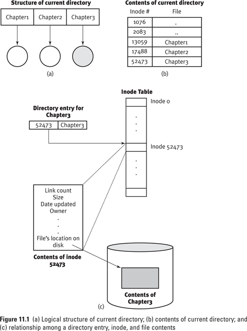
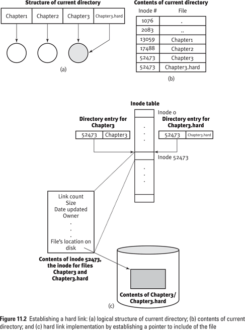
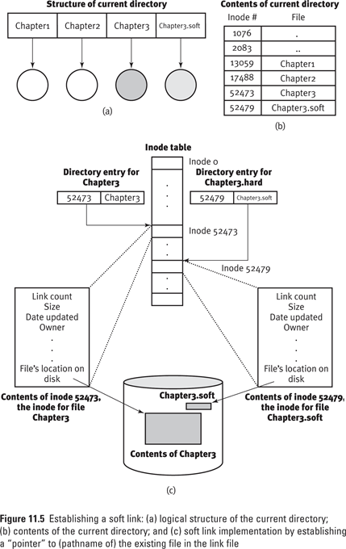

# Lecture 8 File Sharing

## 8.1 File Sharing Usage

- 给文件定义链接

```
alias awk='gawk' # 定义别名,但是每个用户都要定义一遍

# 通过层层链接找到可执行文件
# 以'l'开头就是链接文件
s193157@GOJ:~$ which awk
/usr/bin/awk
s193157@GOJ:~$ ls -l /usr/bin/awk
lrwxrwxrwx 1 root root 21 12月 21  2018 /usr/bin/awk -> /etc/alternatives/awk
s193157@GOJ:~$ ls -l /etc/alternatives/awk
lrwxrwxrwx 1 root root 13 12月 21  2018 /etc/alternatives/awk -> /usr/bin/gawk
s193157@GOJ:~$ ls -l /usr/bin/gawk
-rwxr-xr-x 1 root root 658072 2月  11  2018 /usr/bin/gawk

# 更改符号链接
s193157@GOJ:~$ ln -sf /usr/bin/python2.7 /usr/bin/python
```

## 8.2 File Sharing via Links

### 8.2.1 Hard Links

```
ln [options] existing-file new-file
ln [options] existing-file-list directory
```

- Commonly used options:
    - `-f`  Force creation of link  	
    - `-n`  Don't create the link if 'new-file' exists  	
    - `-s`  Create a symbolic link to 'existing-file' and name it 'new-file'

```
# 创建硬链接文件
s193157@GOJ:~$ ln -f /tmp/chapter3 chapter3.hard
# 文件如下
-rw-rw-rw- 16 zq      zq     6 5月  25 15:57 chapter3.hard
```

- 通过访问相同的索引结点号，访问的数据块相同，所以得到的文件相同

```
s193157@GOJ:~$ ls -i /tmp/chapter3
1969230 /tmp/chapter3
s193157@GOJ:~$ ls -i chapter3.hard
1969230 chapter3.hard
# 发现索引结点号相同
s193157@GOJ:~$ ls -li /tmp/chapter3
1969230 -rw-rw-rw- 29 zq zq 6 5月  25 16:00 /tmp/chapter3
# 有29个同学创建了硬链接文件
```





#### Characteristics of Hard Links 

- No hard links across file systems 不可跨文件系统
- Can‘t create hard links to directories 不能对目录创建硬链接文件
- 不会额外分配存储空间
- 一次硬盘读取
- 在文件删除后依然可以访问文件
    - 在删除一个索引结点的时候先检查 `Link Count` 如果 `Link Count` 大于 0 ，这个索引结点不会被删除

### 8.2.2 Soft / Symbolic Links

```
s193157@GOJ:~$ ls -li chapter3.soft
12321140 lrwxrwxrwx 1 s193157 stu 13 5月  25 16:11 chapter3.soft -> /tmp/chapter3
s193157@GOJ:~$ ls -li /tmp/chapter3
1969230 -rw-rw-rw- 31 zq zq 8 5月  25 16:11 /tmp/chapter3
```

- 通过分配空间的索引节点，同时在硬盘上分配存储空间，存储指向的文件信息



#### Characteristics of Soft Links 

- 可以跨文件系统访问，可链接目录
- 软链接文件在源文件删除后无法访问文件
- 一次访问要访问两次硬盘，效率相对低一些