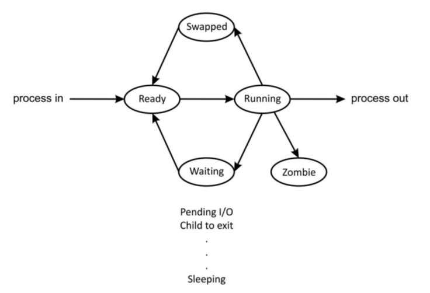
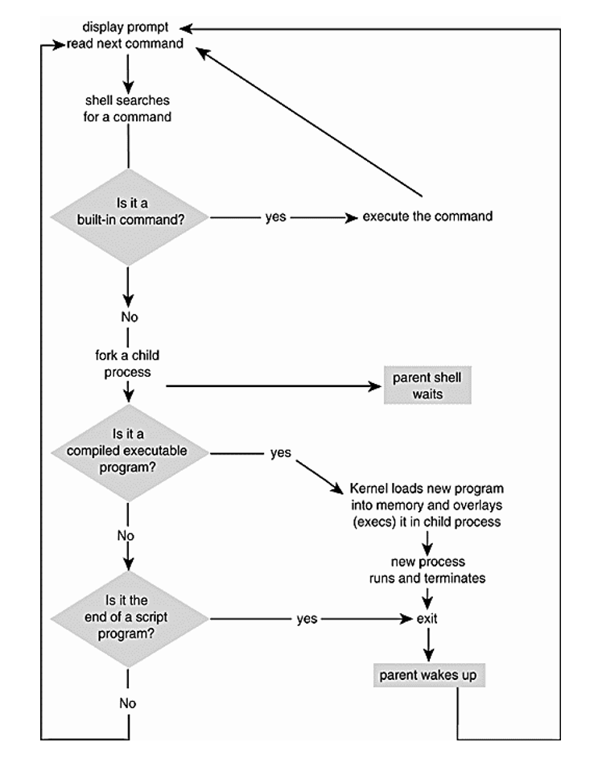
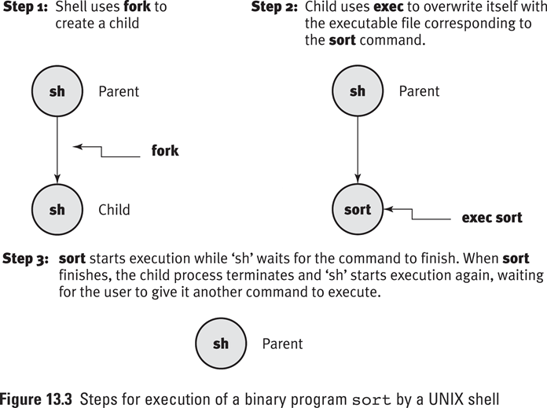
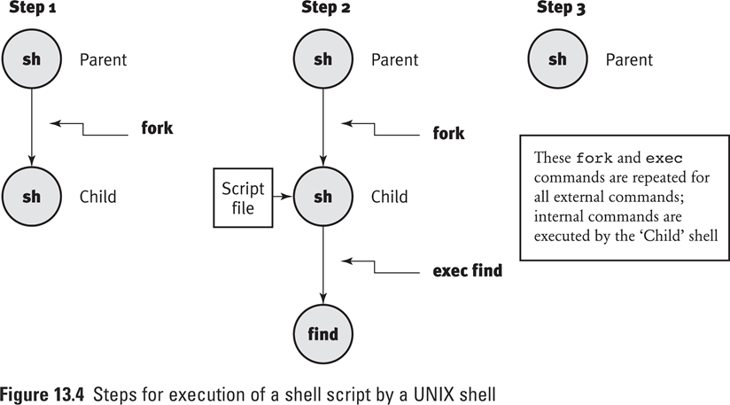

# Lecture 9 Processes

## 9.1 Introduction

- A process is a program in execution
- A process is created every time you run an external command and is removed after the command finishes its execution

## 9.2 Running Multiple Processes Simultaneously

- Processor Scheduler

    - The operating system code that implements the CPU scheduling algorithm （进程调度算法，给进程分配时间片）

- Dispatcher

    - The OS code that takes the CPU away from the current process and hands it over to the newly scheduled process 

- Process’s Priority value is computed by Nice value and CPU usage

    - 如果一个进程使用的CPU时间越多，优先级越低

- `Nice` value is a integer between -20 and 19 （用户控制的静态优先级值，动态值为系统自动计算）

    - ```
        nice –n nice_value command
        ```

### 9.2.1 `ps`  查看终端的进程

```
s193157@GOJ:~$ ps
  PID TTY          TIME CMD
 7449 pts/16   00:00:00 bash
14618 pts/16   00:00:00 ps

PID 进程ID
TTY 进程和哪个终端相关联
TIME 进程使用的CPU时间(真正给进程分配的CPU时间,如为0则不到一秒钟)
CMD 进程名

# 列出进程更为详细的信息
s193157@GOJ:~$ ps -l
F S   UID   PID  PPID  C PRI  NI ADDR SZ WCHAN  TTY          TIME CMD
0 S  1963  7449  7448  0  80   0 -  6991 wait   pts/16   00:00:00 bash
0 R  1963 14821  7449  0  80   0 -  8119 -      pts/16   00:00:00 ps

第一列:0是普通用户的进程, 1是管理员和系统进程
第二列:当前进程的状态 R(运行) S(阻塞)
UID :创建者ID
PPID:父进程ID
C:使用CPU时间
PRI:优先级值 越低,优先级越高 
NI:初始优先级值
ADDR:地址
SZ:占用内存的大小
WCHAN:进程状态

# 给进程降低优先级
s193157@GOJ:~$ nice -n 10 ps -l
F S   UID   PID  PPID  C PRI  NI ADDR SZ WCHAN  TTY          TIME CMD
0 S  1963  7449  7448  0  80   0 -  6991 wait   pts/16   00:00:00 bash
0 R  1963 14838  7449  0  90  10 -  8119 -      pts/16   00:00:00 ps
# 普通用户只能给进程降低优先级,不能提高优先级,保证系统的关键进程得到资源
s193157@GOJ:~$ nice -n -10 ps -l
nice: 无法设置优先级: 权限不够
F S   UID   PID  PPID  C PRI  NI ADDR SZ WCHAN  TTY          TIME CMD
0 S  1963  7449  7448  0  80   0 -  6991 wait   pts/16   00:00:00 bash
0 R  1963 14878  7449  0  80   0 -  8119 -      pts/16   00:00:00 ps
s193157@GOJ:~$ ps -e
# 显示当前系统中所有的进程
```

### 9.2.2 `top` 动态查看系统中的进程

### 9.2.3 `pstree` 查看进程树

## 9.3 Unix Process States

A UNIX process can be in one of many states , as it moves from one state to another , eventually finishing its execution(normally or abnormally) and getting out of the system



- Swapped：存储到硬盘中
- Zombie：进程结束后，无法自己释放 PCB ，当子进程退出的时候，由父进程释放子进程的资源（给父进程发出信号）

## 9.4 Execution of shell Commands

A shell command can be external or internal

- An **internal (built-in) command（内部命令）** is one whose code is part of the shell process
    - `bg, cd,continue, echo, exec`
- An **external command（外部命令）** is one whose code is in a file; contents of the file can be binary code or shell script
    - `grep,more ,cat, mkdir, rmdir, ls`
- `type` ：查看命令类型

```
s193157@GOJ:~$ type echo
echo 是 shell 内建
s193157@GOJ:~$ type rmdir
rmdir 是 /bin/rmdir 
```

A UNIX process can create another process by using the fork system call, which creates an exact main memory map of the original process

- The forking process is known as the parent process
- The created (forked) process is called the child process 



当执行 `ps` 命令后，`bash` 是 `ps` 的父进程（因为 `ps` 的 PPID 等于 `bash` 的 PID）

```
s193157@GOJ:~$ ps -l
F S   UID   PID  PPID  C PRI  NI ADDR SZ WCHAN  TTY          TIME CMD
0 S  1963  7449  7448  0  80   0 -  6991 wait   pts/16   00:00:00 bash
0 R  1963 15337  7449  0  80   0 -  8119 -      pts/16   00:00:00 ps
s193157@GOJ:~$ ps
  PID TTY          TIME CMD
16131 pts/29   00:00:00 bash
17462 pts/29   00:00:00 ps

```

- 执行二进制文件



- 执行脚本文件：需要一个子进程



## 9.5 Process switch

- Foreground and Background Process
- Run a process in the background
    - Append an ampersand(&) to the command line
- suspended Foreground process：`CTRL+Z`
- kill Foreground process：`CTRL+C`
- Display all jobs status：`jobs`
    - Background $\to$ Foreground
        - `fg [%jobnum]`
    - suspended $\to$ Background
        - `bg [%jobnum]`

```
s193157@GOJ:~$ jobs
[1]+  已停止               /tmp/count > /dev/null
[2]-  运行中               /tmp/count > /dev/null &
# 有加号的是刚刚停止的
# 直接用 fg 切换刚刚停止的任务到前台
# fg %2 切换2号到前台
```

## 9.6 UNIX Daemons

- 提供系统服务，精灵进程（守护进程）
- 进程名称以 `d` 结尾

## 9.7 Sequential and Parallel Execution of Commands

- `cmd1;cmd2;…;cmdN`
    - Purpose:	Execute the `‘cmd1’, ‘cmd2’, ‘cmd3’,…,’cmdN’` commands sequentially

- `cmd1& cmd2&…cmdN&`
    - Purpose: Execute commands `‘cmd1’,cmd2’,…’cmdN’` in parallel as separate processes

- UNIX allows you to group commands and execute them as one process by separating commands using semicolons and enclosing them in parenthesis. This is called **command grouping**.
    - `(cmd1;cmd2;…cmdN)`
    - Purpose: Execute commands  `‘cmd1’,’cmd2’…,’cmdN’`  **sequentially but as one process**

## 9.8 Abnormal Termination of Commands and Processes

- Can terminate a foreground process by `<Ctrl-C>`
- Can terminate a background process:
    - Use the kill command
    - By first bringing the process into foreground by using the `fg` command and then pressing `<Ctrl-C>`

- A process can take one of three actions upon receiving a signal
    - Accept the default action as determined by the UNIX kernel （默认方式处理）
    - Ignore the signal
    - Intercept the signal and take a user-defined action（使用自己的方式处理）

**内部信号和外部信号**

- A signal caused by an event internal to a process is known as an **internal signal** or **trap**.
    - 指针异常、除数为 $0$
- A signal caused by an event external to a process is called an **external signal**

- `kill [-signal_number] proc-list`
- `Kill –l`
    Purpose: Send the signal for `‘signal_number’`  to processes whose PIDs or `jobIDs` are specified in the `‘poc-list’`; `jobIDs` must start with `%`.The command `kill –l` return a list of all signals and their names (on some systems, numbers are not displayed)
- Commonly used `signal_numbers`:

```
1			Hangup
2			Interrupt(<Ctrl-C>)
3			Quit(<Ctrl-\>)
9			Sure kill(所有进程都不能忽略这个信号量)
15			Software signal (default signal number)	
```

- 每个用户只能给自己的进程发送信号量，超级用户可以给所有进程发送信号量

- 杀死所有进程 `killall`

```shell
s193157@GOJ:~$ killall count
[2]   已终止               /tmp/count > /dev/null
[3]   已终止               /tmp/count > /dev/null
[4]   已终止               /tmp/count > /dev/null
[5]   已终止               /tmp/count > /dev/null
[6]   已终止               /tmp/count > /dev/null
[7]   已终止               /tmp/count > /dev/null
[8]   已终止               /tmp/count > /dev/null
[9]   已终止               /tmp/count > /dev/null
[10]   已终止               /tmp/count > /dev/null
[11]   已终止               /tmp/count > /dev/null
[12]-  已终止               /tmp/count > /dev/null
[13]+  已终止               /tmp/count > /dev/null

s193157@GOJ:~$ /tmp/neverdie &
[1] 23975
s193157@GOJ:~$ /tmp/neverdie &
[2] 23976
s193157@GOJ:~$ /tmp/neverdie &
[3] 23977
s193157@GOJ:~$ killall neverdie
I won't Die!!!
I won't Die!!!
I won't Die!!!
s193157@GOJ:~$ killall -9 neverdie # 使用9选项终止
[1]   已杀死               /tmp/neverdie
[2]-  已杀死               /tmp/neverdie
[3]+  已杀死               /tmp/neverdie
```

- `nohup commands [args]` 忽略挂起信号量
    - Purpose: Run ‘command and ignore the hang-up signal

## 9.9 Scheduling a Process To Execute Later

- 计划任务：数据备份

| Create  | **at** **time** | **crontab** **-e** |
| ------- | --------------- | ------------------ |
| List    | `at  -l`        | `crontab -l`       |
| Details | `at  -c jobnum` |                    |
| Remove  | `at  -d jobnum` | `crontab -r`       |
| Edit    |                 | `crontab -e`       |

- One-time jobs use `at` ：一次性任务

```
s193157@GOJ:~$ at 23:59 # 在这个时间创建计划任务
warning: commands will be executed using /bin/sh
at> backup
at> /tmp/count
at> <EOT> # Ctrl+D
job 15 at Tue Jun  1 23:59:00 2021

s193157@GOJ:~$ at -l # 查看自己计划任务
15      Tue Jun  1 23:59:00 2021 a s193157

s193157@GOJ:~$ at -c 15 # 查看计划任务具体内容
#!/bin/sh
# atrun uid=1963 gid=1689
# mail s193157 0
.....
backup
/tmp/count

s193157@GOJ:~$ at -d 15 # 删除计划任务

```

- recurring jobs use `crontab` ：周期执行任务

```shell
s193157@GOJ:~$ crontab -e
no crontab for s193157 - using an empty one

Select an editor.  To change later, run 'select-editor'.
  1. /bin/nano        <---- easiest
  2. /usr/bin/vim.basic
  3. /usr/bin/vim.tiny
  4. /bin/ed

Choose 1-4 [1]: 1

# For example, you can run a backup of all your user accounts
# at 5 a.m every week with:
# 0 5 * * 1 tar -zcf /var/backups/home.tgz /home/
```

## 9.10 File Package 文件压缩

- 打包文件

```
s193157@GOJ:/tmp$ tar -zcvf f.tar.gz /tmp/f
tar: 从成员名中删除开头的“/”
/tmp/f/
/tmp/f/f2
/tmp/f/f1
```

- 查看压缩文件的文件结构

```
s193157@GOJ:/tmp$ tar -ztvf f.tar.gz
drwxrwxr-x zq/zq             0 2021-06-08 08:51 tmp/f/
-rw-rw-r-- zq/zq             6 2021-06-08 08:50 tmp/f/f2
-rw-rw-r-- zq/zq             6 2021-06-08 08:50 tmp/f/f1
```

- 解压压缩文件

```
s193157@GOJ:/tmp$ tar -zxvf f.tar.gz
```

