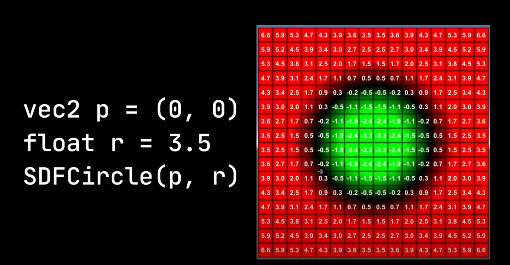
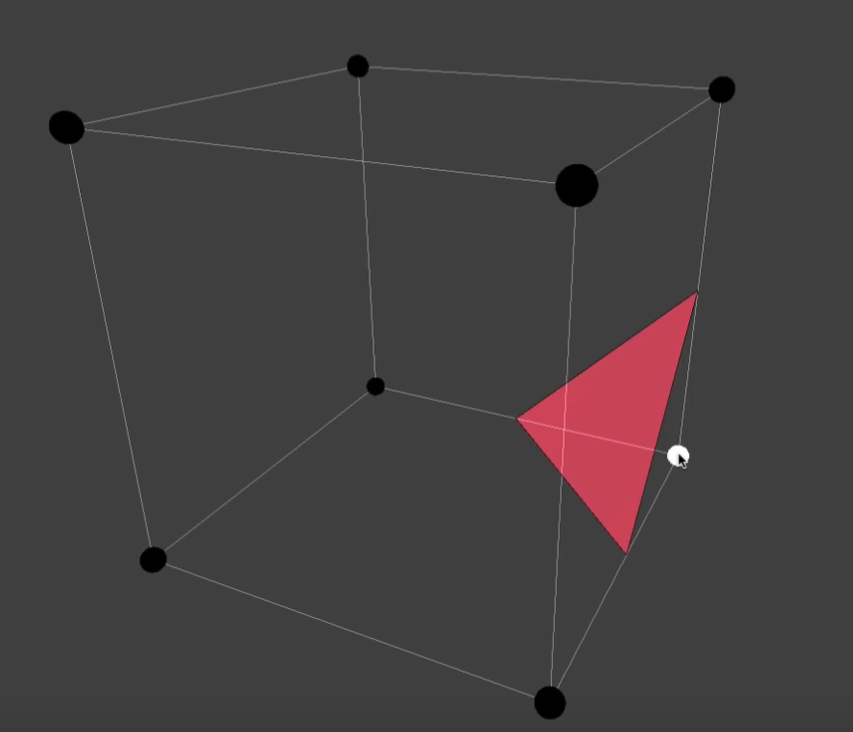

# 3D Scene Analysis

!!! note

    start on: Aug 23, 2023

## Principal of Indoor Scene Network Design

> From the talk of Richard in 2023/9/3 - 2023/9/4

### Description

- function description
- structural description
    - object parts
    - part relations

### 3C Principal

- **consistency**
    - should be considered frist
    - weak prior: same class = same function
    - e.g. cycle consistency (for unpaired domain translation)
    - e.g. VAE (predictable & compressibility $\to$ need redundancy [*symmetry*] )
        - bottle neck layer in neural network: force to compress
- **compactness**
    - model representation
- **continuity**
    - linkage between the scene (bridge gap)

## Scene Hierarchy

- symmetry $\to$ construct graph $\to$ tree
    - rotation
    - reflection
- connectivity

### Differences Between Scene & Shape Hierarchy 

- scene is difficult to align 
- scene has much more variations
- real scenes are much ***messy***
    - note that: messy $\neq$ random
    - why messy: human action & activity (function of objects & co-occurrence of objects)
- sub-scene indicate functional units

### Problems in Complex Scene & Layouts

- Problem #1: compare complex scene & layout 

    - In scene we need focal points (= subscenes)

    - Find focal points (can be regarded as attention machoism in NLP)
        - context will make it easier
        - clustering algorithm [sig 2014]
        - find frequent & discriminate parts
        - do organize or retrieval

- Problem #2: action-driven scene evolution
    - should consider not only see/observe
    - should consider functionality & human action
    - scene understanding = inference of human action (annotated photo $\to$ action model $\to$ action graph)
- Problem #3: text-driven 3D scene synthesis
    - using scene proxy to guide
- Problem #4: generative model of 3D scene structure

## Related Algorithm

### Signed distance field

- signed distance from the edge of a shape
    - inside shape: negative
    - outside shape: positive
    - exactly on the shape: 0

### Marching Cube

> - [游戏编程挑战：生成无边的水下世界 体绘制算法 | Coding Adventure: Marching Cubes](https://www.bilibili.com/video/BV1yJ411r73v/)

使用 3D 空间中的一个点作为输入， 随后返回一个值

$$
f(x,y,z) \to v
$$

假设在空间中的某个区域内，我们可以使用函数 $f$ 等间距的采样一些点

不妨设函数 $f$ 的最大值为 $16$，最小值为 $-32$，如果存在一个表面阈值 $sf$，当表面阈值从 $-32$ 增长到 $16$ 时，均匀采样点就会逐渐消失（视频 0:45）

我们可以认为消失的点是空白的空间，而大于等于表面阈值的点，则处于形体的表面或者内部

如果把这个问题简化到一个立方体内部，如果白色的点位于物体内部，它就被激活，这样我们就得到了一个三角面片

## References

### Web Links

- [Camera Sensor Size](https://designreviews.com/digital-camera-sensor-size-chart/)
- [体渲染 (Volume Rendering)](https://zhuanlan.zhihu.com/p/595117334)

### Learning on Point Cloud

- PointNet
    - [论文解读](https://zhuanlan.zhihu.com/p/264627148)
- PointNet++
    - [论文解读](https://zhuanlan.zhihu.com/p/266324173)
- Dynamic Graph CNN
    - [论文解读](https://zhuanlan.zhihu.com/p/267895014)

