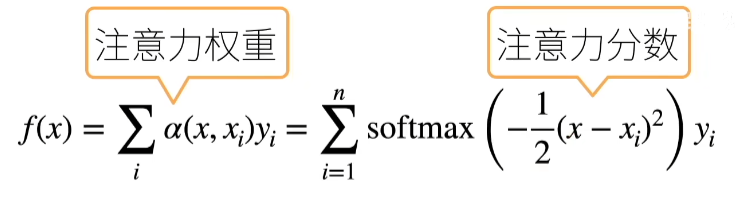
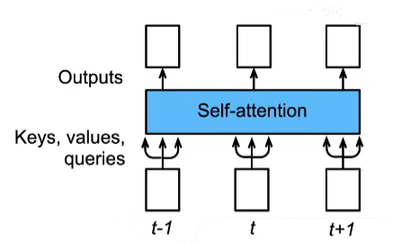
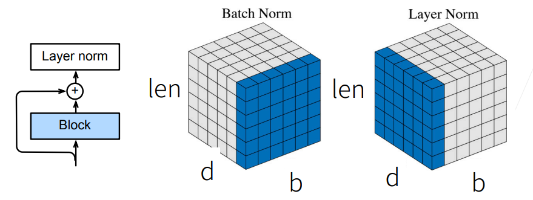
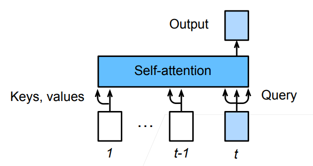

# Attention & Transformer

## Attention Mechanism

- 注意力机制的心理学框架：人类根据随意线索和不随意线索来选择注意点
  - 随意线索：根据人类主观想法的事物（想读书）
  - 不随意线索：不根据人类主观想法的线索（眼睛注意到的红色杯子）
- 卷积、全连接、池化都只考虑不随意线索
- 注意力机制则**显式的**考虑随意线索
  - 随意线索被称之为查询（query）
  - 每一个输入是一个值（value）和不随意线索（key）的对
  - 通过注意力池化层根据 ***query*** 来有偏向性的选择某些输入
  - 可以一般的写作 $f(x)=\sum_i \alpha(x, x_i) y_i$, 这里 $\alpha\left(x, x_i\right)$ 是注意力权重

### 非参注意力池化层

- 给定数据 $(x_i,y_i), i=1,...,n$
- 平均池化（$x$ 为 query）：$f(x)=\frac{1}{n}\sum_iy_i$
- Nadaraya-Watson 核回归：
  - $x$ 为 query
  - $x_i, x_j$ 为 key
  - $y_i$ 为 value
  - $K(x-x_i)$ 为核（kernel），衡量 $x$ 和 $x_i$ 之间距离的函数，会选择和离 $x$ 比较近的 $x_i$
  - 变成概率后每一项 $y_i$ 就是它的相对重要性

$$
f(x)=\sum_{i=1}^n\frac{K(x-x_i)}{\sum_{j=1}^nK(x-x_j)}y_i
$$

如果使用高斯核 $K(u)=\frac{1}{\sqrt{2 \pi}} \exp \left(-\frac{u^2}{2}\right)$ ，那么

$$
\begin{aligned}
f(x) & =\sum_{i=1}^n \frac{\exp \left(-\frac{1}{2}\left(x-x_i\right)^2\right)}{\sum_{j=1}^n \exp \left(-\frac{1}{2}\left(x-x_j\right)^2\right)} y_i \\
& =\sum_{i=1}^n \operatorname{softmax}\left(-\frac{1}{2}\left(x-x_i\right)^2\right) y_i
\end{aligned}
$$

### 参数化的注意力机制

- 在之前的基础上引入可以学习的 $w$ （此处为标量）

$$
f(x)=\sum_{i=1}^n \operatorname{softmax}\left(-\frac{1}{2}\left(\left(x-x_i\right) w\right)^2\right) y_i
$$

## 注意力分数

- 注意力权重：注意力分数的 softmax 结果，也是注意力机制中的注意力评分函数
- 注意力分数：是 query 和 key 的相似度，也就是没有归一化 (softmax) 的注意力权重

- 计算注意力汇聚的输出为值的加权和

### 扩展到高维度

用数学语言描述, 假设有一个查询 $\mathbf{q} \in \mathbb{R}^q$ 和 $m$ 个 “键一值" 对 $\left(\mathbf{k}_1, \mathbf{v}_1\right), \ldots,\left(\mathbf{k}_m, \mathbf{v}_m\right)$, 其中 $\mathbf{k}_i \in \mathbb{R}^k, \mathbf{v}_i \in \mathbb{R}^v$ 。注意力汇聚函数 $f$ 就被表示成值的加权和:

$$
f\left(\mathbf{q},\left(\mathbf{k}_1, \mathbf{v}_1\right), \ldots,\left(\mathbf{k}_m, \mathbf{v}_m\right)\right)=\sum_{i=1}^m \alpha\left(\mathbf{q}, \mathbf{k}_i\right) \mathbf{v}_i \in \mathbb{R}^v,
$$

其中查询 $\mathbf{q}$ 和键 $\mathbf{k}_i$ 的注意力权重（标量）是通过注意力评分函数 $a$ 将两个向量映射成标量, 再经过 softmax 运算得到的:

$$
\alpha\left(\mathbf{q}, \mathbf{k}_i\right)=\operatorname{softmax}\left(a\left(\mathbf{q}, \mathbf{k}_i\right)\right)=\frac{\exp \left(a\left(\mathbf{q}, \mathbf{k}_i\right)\right)}{\sum_{j=1}^m \exp \left(a\left(\mathbf{q}, \mathbf{k}_j\right)\right)} \in \mathbb{R} .
$$

如上所示，**选择不同的注意力评分函数 $a$ 会导致不同的注意力汇聚操作**。

### 注意力评分函数

#### Additive Attention

- 可学参数：$\mathbf{W}_k \in \mathbb{R}^{h \times k}, \mathbf{W}_q \in \mathbb{R}^{h \times q}, \mathbf{v} \in \mathbb{R}^h$
- 将 query 和 key 连结起来后输入到一个多层感知机（MLP）中， 感知机包含一个隐藏层，其隐藏单元数是一个超参数 $h$。通过使用 $\tanh$ 作为激活函数
- 适用于查询和键是不同长度的矢量

$$
a(\mathbf{k}, \mathbf{q})=\mathbf{v}^T \tanh \left(\mathbf{W}_k \mathbf{k}+\mathbf{W}_q \mathbf{q}\right)
$$

#### Scaled Dot-Product Attention

- 如果 query 和 key 都是同样的长度 $\mathbf{q}, \mathbf{k}_i \in \mathbb{R}^d$，$d$ 是 query 和 key 的长度，那么
- 其实就是直接对 query 和 key 做点积

$$
a\left(\mathbf{q}, \mathbf{k}_{\mathbf{i}}\right)=\left\langle\mathbf{q}, \mathbf{k}_{\mathbf{i}}\right\rangle / \sqrt{d}
$$

- 向量化版本
  - $\mathbf{Q} \in \mathbb{R}^{n \times d}, \mathbf{K} \in \mathbb{R}^{m \times d}, \mathbf{V} \in \mathbb{R}^{m \times v}$
  - 注意力分数: $a(\mathbf{Q}, \mathbf{K})=\mathbf{Q}\mathbf{K}^T / \sqrt{d} \in \mathbb{R}^{n \times m}$
  - 注意力池化: $f=\operatorname{softmax}(a(\mathbf{Q}, \mathbf{K})) \mathbf{V} \in \mathbb{R}^{n \times v}$

## Transfomer

- Transfomer 是纯使用注意力的 encoder-decoder
- encoder-decoder 都有 $n$ 个 transformer 块

### Self-Attention

> 自注意力描述了如何选择 key, value, query

- 给定序列 $\mathbf{x}_1, \ldots, \mathbf{x}_n, \forall \mathbf{x}_i \in \mathbb{R}^d$
- 自注意力池化层将 $\mathbf{x}_i$ 当做 key, value, query 来对序列抽取特征得到 $\mathbf{y}_1, \ldots, \mathbf{y}_n$，这里有

$$
\mathbf{y}_i=f\left(\mathbf{x}_i\left(\mathbf{x}_1, \mathbf{x}_1\right), \ldots,\left(\mathbf{x}_n, \mathbf{x}_n\right)\right) \in \mathbb{R}^d
$$

### 位置编码

- 自注意力机制没有记录位置信息
- 加入位置信息方法：位置编码
- 位置编码将位置信息注入到输入中（不在模型中加），让输入的内容具有位置信息
  - 假设长度为 $n$ 的序列是 $\mathbf{X} \in \mathbb{R}^{n \times d}$ ，那么使用位置编码矩阵 $\mathbf{P} \in \mathbb{R}^{n \times d}$ 来输出 $\mathbf{X}+\mathbf{P}$ 作为自编码输入
  - $\mathbf{P}$ 的元素如下计算（偶数行和奇数行的区别）：$p_{i, 2 j}=\sin \left(\frac{i}{10000^{2 j / d}}\right), \quad p_{i, 2 j+1}=\cos \left(\frac{i}{10000^{2 j / d}}\right)$
  - 使用正弦和余弦函数的好处：编码的是相对的位置信息

### 多头注意力 Multihead-Attention

- 对同一key, value, query, 希望抽取不同的信息
  - 例如短距离关系和长距离关系
- 多头注意力使用 $h$ 个独立的注意力池化
  - 合并各个头 (head) 输出得到最终输出

### 数学描述

在实现多头注意力之前, 让我们用数学语言将这个模型形式化地描述出来。给定查询 $\mathbf{q} \in \mathbb{R}^{d_q}$ 、键 $\mathbf{k} \in \mathbb{R}^{d_k}$ 和 值 $\mathbf{v} \in \mathbb{R}^{d_v}$, 每个注意力头 $\mathbf{h}_i$ ( $i=1, \ldots, h)$ 的计算方法为:

$$
\mathbf{h}_i=f\left(\mathbf{W}_i^{(q)} \mathbf{q}, \mathbf{W}_i^{(k)} \mathbf{k}, \mathbf{W}_i^{(v)} \mathbf{v}\right) \in \mathbb{R}^{p v}
$$

- 其中, 可学习的参数包括 $\mathbf{W}_i^{(q)} \in \mathbb{R}^{p q \times d_q} 、 \mathbf{W}_i^{(k)} \in \mathbb{R}^{p k \times d k}$ 和 $\mathbf{W}_i^{(v)} \in \mathbb{R}^{p v \times d v}$, 以及代表注意力汇聚的函数 $f$
- $f$ 可以是加性注意力和缩放点积注意力
- 多头注意力的输出需要经过另一个线性转换, 它对应着 $h$ 个头连结后的结果, 因此其可学习参数是$\mathbf{W}_o \in \mathbb{R}^{p_o \times h p_v}$

$$
\mathbf{W}_o\left[\begin{array}{c}
\mathbf{h}_1 \\
\vdots \\
\mathbf{h}_h
\end{array}\right] \in \mathbb{R}^{p_o}
$$

### 有掩码的多头注意力

- decoder 对序列中的一个元素输出时，不应该考虑此元素之后的元素
- 这可以通过掩码来实现，也就是计算 $\mathbf{x_i}$ 的输出时，假装当前的序列长度仅为 $i$

### 基于位置的前馈网络

- 其实就是全连接层，$b$ 是 batch size，$n$ 是序列长度，$d$ 是维度
- 对序列中的每个元素做全连接，把序列中的每一个 $x_i$ 当作一个样本，网络做如下操作
  - 将输入形状由 $(b, n, d)$ 变换成 $(b n, d)$ 
  - 作用两个全连接层
  - 输出形状由 $(b n, d)$ 变化回 $(b, n, d)$
- 等价于两层核窗口为 1 的一维卷积层

### 层归一化

- 批量归一化（batch norm）对每个特征/通道里元素进行归一化
  - batch norm 是对所有句子的所有词的某一特征做归一化
  - 不适合序列长度会变的 NLP 应用
- 层归一化（layer norm）对每个样本里的元素进行归一化
    - layer norm 是对一个句子的所有词的所有特征做归一化

### 信息传递

> 信息怎么从 encoder 传到 decoder

- 对于编码器中的输出 $\mathbf{y}_1, \ldots, \mathbf{y}_n$
- 将其作为解码中第 $i$ 个Transformer块中多头注意力的key和value
  - 它的 query 来自目标序列
  - 之前的两个 Multi-head attention 采用的是自注意力 
- 意味着编码器和解码器中块的个数和输出维度都是一样的

### 预测

- 预测第 $t+1$ 个输出时
- 解码器中输入前 $t$ 个预测值
  - 在自注意力中, 前 $t$ 个预测值作为 key 和 value, 第 $t$ 个预测值还作为 query，输出第 $t+1$ 时刻的预测

