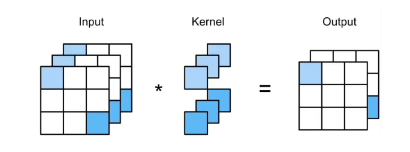

# Convolution & CNN

## 卷积层

- 卷积层将输入和核矩阵进行交叉相关，加上偏移后得到输出
- 核矩阵和偏移是可学习的参数
- 核矩阵的大小是超参数（控制局部性 $\to$ 看的范围）
- 可以看成特殊的全连接层

## 填充和步幅

- 填充和步幅是卷积层的超参数
- 填充在输入周围添加额外的行 / 列, 来控制输出形状的减少量
- 步幅是每次滑动核窗口时的行/列的步长, 可以成倍的减少输出形状

### 填充

- 在输入的周围加入额外的行和列

- 填充 $p_h$ 行和 $p_w$ 列, 输出形状为 (p = padding)

$$
\left(n_h-k_h+p_h+1\right) \times\left(n_w-k_w+p_w+1\right)
$$

- 通常取 $p_h=k_h-1, \quad p_w=k_w-1$ (这样输出和输入的 shape 一致)
    - 当 $k_h$ 为奇数：在上下两侧填充 $p_h / 2$
    - 当 $k_h$ 为偶数：在上侧填充 $\left\lceil p_h / 2\right\rceil$, 在 下侧填充 $\left\lfloor p_h / 2\right\rfloor$

### 步幅

- 填充减小的输出大小与层数线性相关
    - 给定输入大小 $224 \times 224$，在使用 $5 \times 5$ 卷积核的情况下，需要 $55$ 层才能将输出降低到 $4 \times 4$
    - 需要大量计算才能得到较小输出

- 步幅是指行/列的滑动步长
    - 例：高度 3，宽度 2 的步幅

- 给定高度 $s_h$ 和宽度 $s_w$ 的步幅, 输出形状是

$$
\left\lfloor\left(n_h-k_h+p_h+s_h\right) / s_h\right\rfloor \times\left\lfloor\left(n_w-k_w+p_w+s_w\right) / s_w\right\rfloor
$$

- 如果 $p_h=k_h-1, \quad p_w=k_w-1$

$$
\left\lfloor\left(n_h+s_h-1\right) / s_h\right\rfloor \times\left\lfloor\left(n_w+s_w-1\right) / s_w\right\rfloor
$$

- 如果输入高度和宽度可以被步幅整除

$$
\left(n_h / s_h\right) \times\left(n_w / s_w\right)
$$

## 通道数

- 彩色图像有 RGB 三个通道，因此转换为灰度会丢失信息，所以我们需要多通道的输入
- 每个输出通道可以识别特定模式
- 输入通道核识别并组合输入中的模式

### 多个输入通道

- 每个通道都有一个卷积核，计算结果是所有通道卷积结果的和

$$
\begin{aligned}
& (1 \times 1+2 \times 2+4 \times 3+5 \times 4) \\
& +(0 \times 0+1 \times 1+3 \times 2+4 \times 3)=56
\end{aligned}
$$

- 输入 $\mathbf{X}: c_i \times n_h \times n_w$
- 核 $\mathbf{W}: c_i \times k_h \times k_w^{\circ}$
- 输出 $\mathbf{Y}: m_h \times m_w$

$$
\mathbf{Y}=\sum_{i=0}^{c_i} \mathbf{X}_{i,:,:}\star \mathbf{W}_{i,:,:}
$$

### 多个输出通道

- 无论有多少输入通道，到目前为止我们只用到单输出通道
- 我们可以有多个三维卷积核, 每个核生成一个输出通道
- 输入 $\mathbf{X}: c_i \times n_h \times n_w$
- 核 $\mathbf{W}: c_o \times c_i \times k_h \times k_w$
- 输出 $\mathbf{Y}: c_o \times m_h \dot{\times} m_w$

$$
\mathbf{Y}_{i,:,:}=\mathbf{X} \star \mathbf{W}_{i,:,:,:} \quad \text { for } i=1, \ldots, c_o
$$

### 1x1 卷积层

$k_h=k_w=1$ 是一个受欢迎的选择。它不识别空间模式, 只是融合通道。

### 二维卷积层的参数

- 输入 $\mathbf{X}: c_i \times n_h \times n_w$
- 核 $\mathbf{W}: c_o \times c_i \times k_h \times k_w$
- 偏差 $\mathbf{B}: c_o \times c_i$
- 输出 $\mathbf{Y}: c_o \times m_h \times m_w$

## 池化/汇聚层 (Pooling)

- 使用池化层的理由：卷积对位置敏感，需要降低卷积层对位置的敏感性、降低对空间降采样表示的敏感性
    - 在检测垂直边缘不好，1像素移位就可能导致 0 输出

- 池化层返回窗口中最大或平均值
- 缓解卷积层对位置的敏感性
- 同样有窗口大小、填充、和步幅作为超参数

### 二维最大池化

- 直接返回滑动窗口中的最大值
- 最大池化层: 每个窗口中最强的模式信号

$$
\max (0,1,3,4)=4
$$

### 平均池化层

- 平均池化层：将最大池化层中的 “最大” 操作替换为 “平均”

## LeNet

总体来看，LeNet（LeNet-5）由两个部分组成：

- 卷积编码器：由两个卷积层组成
- 全连接层密集块：由三个全连接层组成

[^1]: LeNet中的数据流。输入是手写数字，输出为10种可能结果的概率

## AlexNet

[^]: 从LeNet（左）到AlexNet（右）

## VGG

- 使用块的网络，对 AlexNet 的改进是去除了一些不规则的部分，改为用块来连接（更大更深的 AlexNet，通过重复的 VGG 块）

- VGG 的重要思想
    - 使用可重复的块来构建深度学习网络（构建一个好的块，累加多个块就可以得到一个好的网络）
    - 网络可以使用不同的配置（低配网络、高配网络）

## 网络中的网络 NiN

- 卷积层需要较少的参数

$$
c_i \times c_o \times k^2
$$
- 但卷积层后的第一个全连接层 的参数
    - LeNet $16 \times 5 \times 5 \times 120=48 \mathrm{k}$
    - AlexNet $256 \times 5 \times 5 \times 4096=26 \mathrm{M}$
    - VGG $512 \times 7 \times 7 \times 4096=102 \mathrm{M}$

- 参数太多的问题
    - 内存占用多
    - 计算带宽占用大，访问内存耗时长
    - 容易过拟合

- NiN 的思想：完全不需要卷积层

### NiN 块

- 一个卷积层后跟两个全连接层
    - 步幅 1，无填充，输出形状和卷积层输出一样
    - 起到全连接层的作用

- 无全连接层
- 交替使用 NiN 块和步幅为 2 的最大池化层
    - 逐步减少高宽和增大通道数
- 最后使用平均池化层得到输出
    - 输入通道数是类别数

### Summary

- NiN 块使用卷积层加两个 1x1 卷积层
    - 后者对每个像素增加了非线性性

- NiN 使用全局平均池化层来替代 VGG 和 AlexNet 中的全连接层
    - 这样不容易过拟合，并且有更少的参数个数

## 含并行连结的网络 GoogLeNet

- 第一个超过 100 层的 CNN
- 上述网络都涉及到卷积块的超参数选择，如何选择最好的超参数
    - 使用 Inception 块：小学生才做选择题，我全都要

### Inception 块

- Inception 块有 4 个路径，从不同的层面抽取信息，然后在输出通道合并
- 和单 3x3 或 5x5 卷积层比，Inception 块有更少的参数个数和计算复杂度

### Architecture

## 批量归一化 Batch Normalization

- 损失出现在最后，后面的层训练较快
- 数据在最底部
    - 底部的层训练较慢
    - 底部的层一产生变化，所以都得跟着变
    - 最后的那些层需要学习多次
    - 导致收敛变慢

- 需要在学习底部层的时候避免顶部的重复训练

### Method

- 固定小批量中的均值和方差

$$
\mu_B=\frac{1}{|B|} \sum_{i \in B} x_i \text { and } \sigma_B^2=\frac{1}{|B|} \sum_{i \in B}\left(x_i-\mu_B\right)^2+\epsilon
$$

然后再做额外的调整（$\gamma, \beta$ 是可学习的参数）

$$
x_{i+1}=\gamma \frac{x_i-\mu_B}{\sigma_B}+\beta
$$

### Summary

- 批量归一化固定小批量中的均值和方差，然后学习出合适的偏移和缩放
- 可以加速收敛速度（可以使用较大的学习率），但一般都不改变模型精度 

## ResNet

- 加更多的层不总是能改进精度

### 残差块

- 串联一个层改变函数类，我们希望扩大函数类
- 残差块加入快速通道来得到 $f(x) = x + g(x)$ 的结构

### ResNet-18

