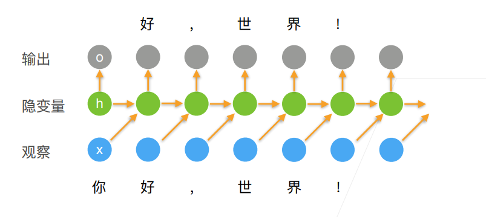
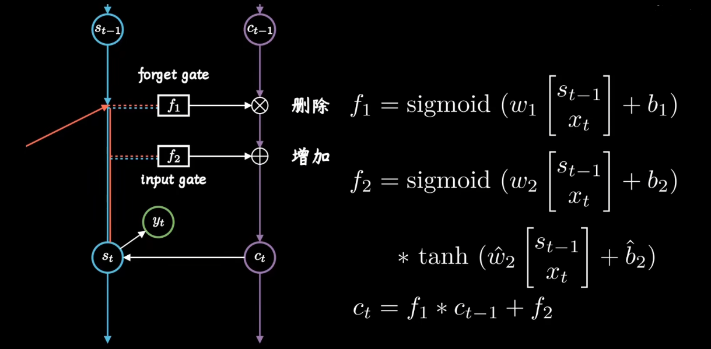

# 序列和RNN

## 序列模型

- 在时间 $t$ 观察到 $x_t$, 那么得到 $T$ 个不独立的随机变量 $\left(x_1, \ldots x_T\right) \sim p(\mathbf{x})$
- 使用条件概率展开

$$
p(a, b)=p(a) p(b \mid a)=p(b) p(a \mid b)
$$

- 对条件概率建模：给定前面的 $t-1$ 个数据去预测第 $t$ 个数据，可以用以下公式表示
  - 对见过的数据建模，也称为**自回归模型**
  - 目标是计算 $f(x_1, \ldots x_{t-1})$

$$
p\left(x_t \mid x_1, \ldots x_{t-1}\right)=p\left(x_t \mid f\left(x_1, \ldots x_{t-1}\right)\right)
$$

### 马尔可夫假设

- 假设当前当前数据只跟 $\tau$ 个过去数据点相关

### 潜变量模型 latent variable

- 引人潜变量 $h_t$ 来表示过去信息 $h_t=f\left(x_1, \ldots x_{t-1}\right)$
  - 这样 $x_t=p\left(x_t \mid h_t\right)$

## 语言模型

- 给定文本序列 $x_1, \ldots, x_T$，语言模型的目标是估计联合概率 $p\left(x_1, \ldots, x_T\right)$，使用统计方法时常采用 $n$ 元语法

- 它的应用包括：
  - 做预训练模型 (eg BERT, GPT-3)
  - 生成本文, 给定前面几个词, 不断的使用 $x_t \sim p\left(x_t \mid x_1, \ldots, x_{t-1}\right)$ 来 生成后续文本
  - 判断多个序列中哪个更常见, e.g. “to recognize speech” vs "to wreck a nice beach

### 使用计数来建模

看这个序列在文本中出现的次数，除以句子长度

- 假设序列长度为 $2$ , 我们预测
  - 这里 $n$ 是总词数, $n(x), n\left(x, x^{\prime}\right)$ 是单个单词和连续单词对的出现次数

$$
p\left(x, x^{\prime}\right)=p(x) p\left(x^{\prime} \mid x\right)=\frac{n(x)}{n} \frac{n\left(x, x^{\prime}\right)}{n(x)}
$$

- 很容易拓展到长为 $3$ 的情况

$$
p\left(x, x^{\prime}, x^{\prime \prime}\right)=p(x) p\left(x^{\prime} \mid x\right) p\left(x^{\prime \prime} \mid x, x^{\prime}\right)=\frac{n(x)}{n} \frac{n\left(x, x^{\prime}\right)}{n(x)} \frac{n\left(x, x^{\prime}, x^{\prime \prime}\right)}{n\left(x, x^{\prime}\right)}
$$

#### N元语法

- 当序列很长时, 因为文本量不够大, 很可能 $n\left(x_1, \ldots, x_T\right) \leq 1$
- 使用马尔科夫假设可以缓解这个问题

一元语法 ($\tau = 0$) :
$$
\begin{aligned}
p\left(x_1, x_2, x_3, x_4\right) & =p\left(x_1\right) p\left(x_2\right) p\left(x_3\right) p\left(x_4\right) \\
& =\frac{n\left(x_1\right)}{n} \frac{n\left(x_2\right)}{n} \frac{n\left(x_3\right)}{n} \frac{n\left(x_4\right)}{n} \\

\end{aligned}
$$
二元语法 ($\tau = 1$) :
$$
\begin{aligned}
p\left(x_1, x_2, x_3, x_4\right) & =p\left(x_1\right) p\left(x_2 \mid x_1\right) p\left(x_3 \mid x_2\right) p\left(x_4 \mid x_3\right) \\
& =\frac{n\left(x_1\right)}{n} \frac{n\left(x_1, x_2\right)}{n\left(x_1\right)} \frac{n\left(x_2, x_3\right)}{n\left(x_2\right)} \frac{n\left(x_3, x_4\right)}{n\left(x_3\right)}
\end{aligned}
$$
三元语法  ($\tau = 2$) : 
$$
p\left(x_1, x_2, x_3, x_4\right)=p\left(x_1\right) p\left(x_2 \mid x_1\right) p\left(x_3 \mid x_1, x_2\right) p\left(x_4 \mid x_2, x_3\right)
$$

## 循环神经网络

- 当前时刻的输出是要去预测当前时刻的观察，输出发生在观察之前，隐变量由 $t-1$ 时刻的观察更新
- 比较 $o_t$ 和 $x_t$ 来计算损失
- 更新隐藏状态： $\mathbf{h}_t=\phi\left(\mathbf{W}_{h h} \mathbf{h}_{t-1}+\mathbf{W}_{h x} \mathbf{x}_{t-1}+\mathbf{b}_h\right)$
  - $\mathbf{W}_{h h}$：表示 $h\to h$ 的更新
  - $\mathbf{W}_{h x}$：表示 $x\to h$ 的更新
  - 去掉 $\mathbf{W}_{h h} \mathbf{h}_{t-1}$ 就是 MLP
- 输出： $\mathbf{o}_t=\phi\left(\mathbf{W}_{h o} \mathbf{h}_t+\mathbf{b}_o\right)$

### 困惑度（perplexity）

- 衡量一个语言模型的好坏可以用平均交叉熵

$$
\pi=\frac{1}{n} \sum_{i=1}^n-\log p\left(x_t \mid x_{t-1}, \ldots\right)
$$

$p$ 是语言模型的预测概率, $x_t$ 是真实词

- 历史原因NLP使用困惑度 $\exp (\pi)$ 来衡量, 是平均每次可能选项
- $1$ 表示完美, 无穷大是最差情况

### 梯度裁剪

- 迭代中计算这 $T$ 个时间步上的梯度, 在反向传播过程中产 生长度为 $O(T)$ 的矩阵乘法链, 导致数值不稳定
- 梯度裁剪能有效预防梯度爆炸
  - 如果梯度长度超过 $\theta$，那么投影回长度 $\theta$

$$
\mathbf{g} \leftarrow \min \left(1, \frac{\theta}{\|\mathbf{g}\|}\right) \mathbf{g}
$$

## LSTM

- 包含了长期记忆 $c_t$ 的 RNN，当前输出不仅仅由 $x_{t-1}$ 和 $s_{t}$ 得到，还由长期记忆 $c_t$ 控制

- forget gate：删除长期记忆的过程
  - 过滤重要特征，忽略无关信息
- input gate：增添长期记忆的过程
  - sigmoid：对内容进行选择
  - tanh: 相当于对信息进行整理

## 深层循环神经网络

- 深度循环神经网络使用多个隐藏层来获得更多的非线性性

## 双向循环神经网络

- 动机：未来很重要，过去和未来的上下文不同，结果可能很不一样，截止目前 RNN 只看过去的信息
- 双向 RNN：包含一个前向 RNN hidden layer、一个后向 RNN hidden layer，通过合并两个 hidden state 得到输出
- **不好做预测**：双向循环神经网络通过反向更新的隐藏层来利用方向时间信息，通常用来对序列抽取特征、填空，而不是预测末来

$$
\begin{aligned}
& \overrightarrow{\mathbf{H}}_t=\phi\left(\mathbf{X}_t \mathbf{W}_{x h}^{(f)}+\overrightarrow{\mathbf{H}}_{t-1} \mathbf{W}_{h h}^{(f)}+\mathbf{b}_h^{(f)}\right) \\
& \overleftarrow{\mathbf{H}}_t=\phi\left(\mathbf{X}_t \mathbf{W}_{x h}^{(b)}+\overleftarrow{\mathbf{H}}_{t+1} \mathbf{W}_{h h}^{(b)}+\mathbf{b}_h^{(b)}\right) \\
& \mathbf{H}_t=\left[\overrightarrow{\mathbf{H}}_t \overleftarrow{\mathbf{H}}_t\right] \\
& \mathbf{O}_t=\mathbf{H}_t \mathbf{W}_{h q}+\mathbf{b}_q
\end{aligned}
$$

