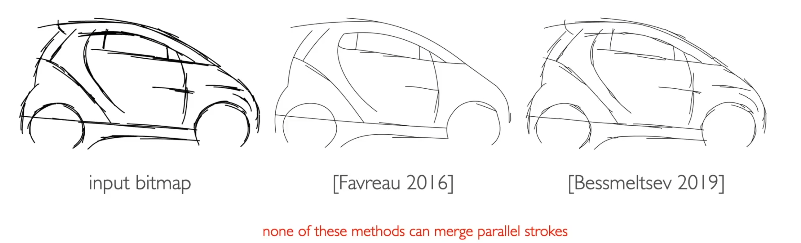

## Background

- sketch vectorization: convert a bitmap line drawing into a compact set of parametric curves
- challenges:
  - over-sketching
  - junctions 交叉
  - noise
- existing methods: use 2 steps
  - segment the drawing into individual curves
  - fit a parametric spline on each curve

- Cons of others method: can not deal with the condition of parallel sketch(merge)
  - A possible fix: use the preprocess method (deep network)
    - Break the topology
    - Fail to merge some of strokes

- Advantage: nearby strokes with similar directions get snapped to the same grid isoline & junction get snapped to the vertices of the grid
- Idea: vectorization via parameterization
- Inspiration: quad meshing

## Related Work

- [Noris et al., 2013] relies on a skeleton, requiring clean input.
- [Favreau et al., 2016] use region based skeleton, which is more robust to over sketching. However, this optimization can only merge consecutive curves, not parallel ones.
- [Bessmeltsev and Solomon, 2019], which vectorizes line drawings by tracing streamlines along a frame field aligned with the input drawing.

## Method 

- 使用 grid isoline 拟合 sketch

### Framework Overview

- Compute a ***frame field*** to recover the two local dominant directions at each pixel
- Use ***frame field*** to guide a grid-based parametrization whose isolines snap to strokes
- Tracing the isolines tangential to the strokes gives a ***parametrized topological graph*** of the drawing
- Fit a network of vector curves using graph in step 3

### pre-processing

- idea: discretize the input domain(by using black pixels) [Bessmeltsev and Solomon 2019]
- Locate the strokes, estimate their width, and generate a triangle mesh around them that will serve as support for the parametrization.
- identify stroke pixels by thresholding the input image
- discretize the image space via a triangulation that we compute using TRIANGLE [She96].
- define a narrow band by selecting triangles with a barycenter at a distance less than $\beta \omega$ from a stroke pixel.
  - $\omega$ : average stroke width
  - $\beta$ : resolution-independent ( $0.0 \sim 0.3$ for clean input, $0,5 \sim 1.2$ for over-sketched input)

### Grid-Based Vectorization: Frame Field

- Compute a frame field representing the two dominant directions at each point in the vicinity of the drawing
- Frame field computation using energy formulation proposed by Bessmeltsev and Solomon
  - combines three terms responsible for aligning the frame field with the strokes of the drawing, smoothing the frame field away from the strokes, and a regularizer encouraging the frame field to form orthogonal crosses rather than to collapse to a line field.

### Parametrization

$$
\text { minimize } E[f]=E_{\text {field-aligned }}+\mu E_{\text {snap }}+\varepsilon E_{\text {reg }} \text { s.t. } f \text { is seamless }
$$

$E_{\text {field-aligned }}$: a frame should be mapped to the canonical frame, and have a parameter control how many strokes should be merged

$$
E_{\text {align }}=\sum_{T \in \mathcal{T}}\left\|\mathcal{J}_f \tilde{\phi}-\mathrm{I}\right\|_{\mathrm{F}}^2
$$

$\mu E_{\text {snap }}$: snapping grid to the isoline (intuition: nearby strokes can be grouped together by assigning them to the same, quantized isoline of the parametrization.)

- 每个三角面片都有两个 direction $u, v$ ，其中一个 direction 会被选择为 tangent direction
- 假设一个三角面片的 tangent direction 为 $u ， u$ 要尽可能的靠近参数空间中的 isoline，另一个 direction 会被施加约束
- Additional integer variable $(i, j)$ : 表示参数空间中的 isoline
- 此项被定义为一个 soft constraint，使得 stroke 三角形的受约束参数受到其最近 integer variable 的吸引
- 注: 这里的 additional integer variable 并不是一个三角面片一个，而是决定好一个三角面片之后，周围的三角面片使用同样的 additional integer variable 

$$
E_{\text {snap }}=\sum_{c \in \mathcal{C}_{\mathrm{c}}} w_{\text {snap }}\|u-\bar{u}\|^2+\sum_{c \in \mathcal{C}_t} w_{\text {snap }}\|v-\bar{v}\|^2
$$

- Choose Tangent Direction
  - trace the streamlines in each of the two frame field directions
  - count the number of black pixels encountered by each streamline
  - direction with more black pixels is the tangent direction
  - Note: black dots correspond to cases when the two pixel counts are very close, in which cas we leave the triangle unlabelled and we don't use it for snapping

$\varepsilon E_{r e g}:$ L2 regression

### Extraction & Fitting

- QEx [Ebke et al.: "QEx: Robust Quad Mesh Extraction", ACMIOG (SIGGRAPH Asia) 2013.]
- only extract tangent edges (identified using the tangent labels)

## Result

