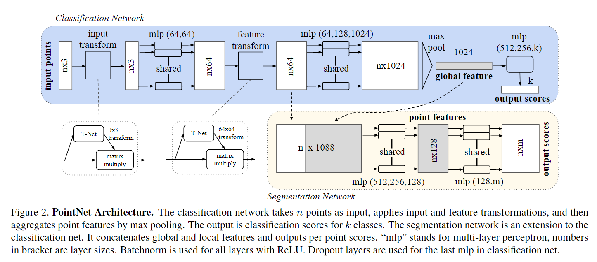
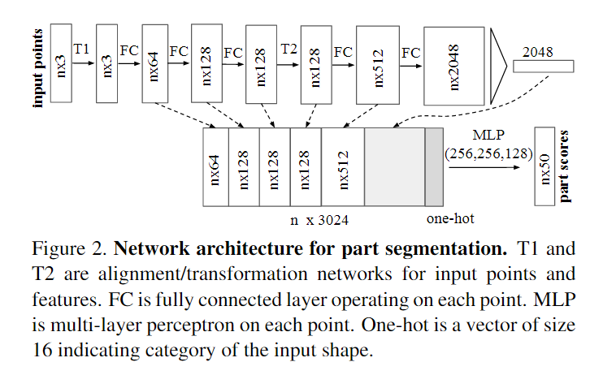
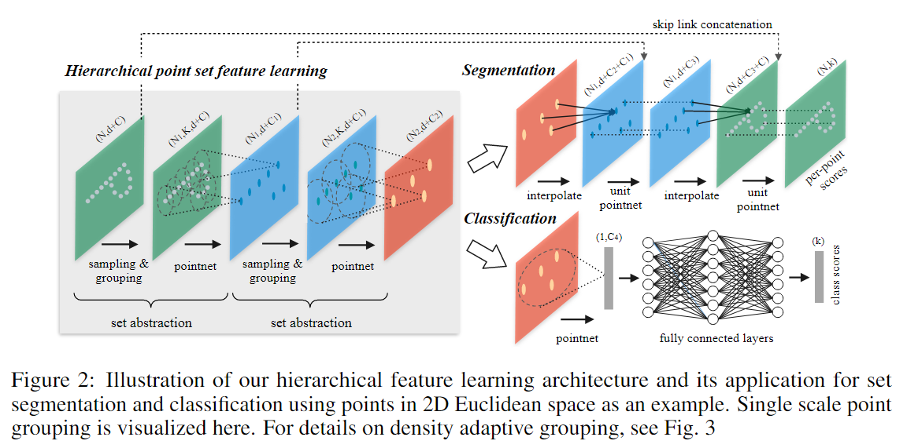
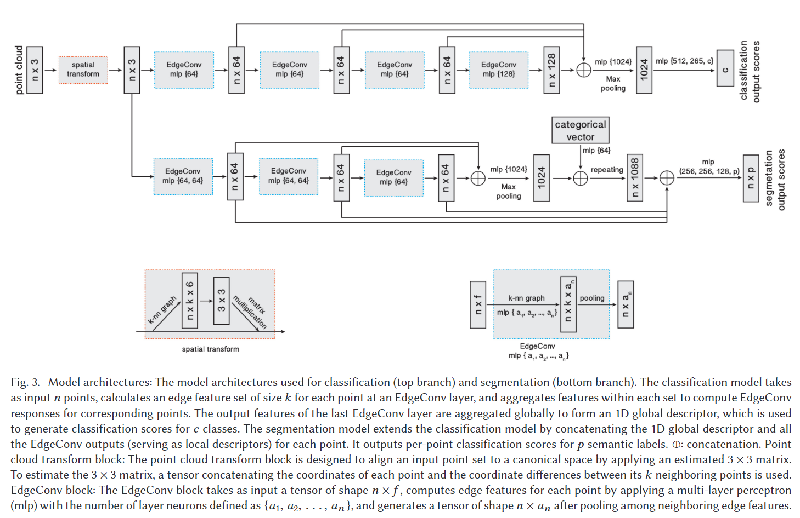

# Point Cloud Feature Extraction

## Concept Explanation

- 点云的排列不变性（permutation invariance & Invariance under transformations）: As a geometric object, the learned representation of the point set should be invariant to certain transformations. For example, rotating and translating points all together should not modify the global point cloud category nor the segmentation of the points

## PointNet

### Architecture

### Symmetry Function for Unordered Input (max pooling layer)

- 为了使模型对输入排列不敏感，有三种策略
    - 将输入排序为规范顺序（但对于高维空间，不存在一种普遍意义上稳定的排序，因此排序并不完全解决了输入顺序的问题）
    - 将输入视为序列以训练 RNN，但通过各种排列来扩充训练数据 （RNN 很难处理好成千上万长度的这种输入元素）
    - 使用简单的对称函数来汇总每个点的信息（PointNet采用的策略）

对称函数的设计如下：

$$
f\left(\left\{x_1, \ldots, x_n\right\}\right) \approx g\left(h\left(x_1\right), \ldots, h\left(x_n\right)\right)
$$

$f$ 为目标函数，$g$ 为近似 $f$ 的函数（期望设计的对称函数），对于点云中的每个点 $x_1, x_2, ...x_n$ ，使用函数 $h$ 处理后送给对称函数 $g$ ，以实现排列不变

### Local and Global Information Aggregation

- 需要 point-wise feature 
- 直接拼接全局特征和局部特征

### Joint Alignment Network

- 用于实现网络对于仿射变换、刚体变换等变换的无关性
- 一种直接的思路：将所有的输入点集对齐到一个统一的点集空间 (Normalization)
    - 使点云数据在处理之前具有一定的一致性，以便更容易进行特征提取、分类、分割或其他分析任务
    - 确保输入的几何结构或语义信息不受刚性变换（如平移、旋转）的影响
- PointNet采用的策略：直接预测一个变换矩阵（$3\times 3$）来处理输入点的坐标
    - 使用 T-net 来预测仿射变换矩阵，然后将此变换应用于输入点的坐标
    - T-net: point independent feature extraction, max pooling and MLP

## PointNet++

### Background

- PointNet 的缺陷：只使用了MLP和max pooling，没有能力捕获局部结构，因此在细节处理和泛化到复杂场景上能力有限
- PointNet 的几个问题
    - Point-wise MLP：仅仅是对每个点表征，对局部结构信息整合能力太弱 $\to$ **PointNet++的改进：sampling 和 grouping 整合局部邻域**
    - Global feature 直接由 max pooling 获得：无论是对分类还是对分割任务，都会造成巨大的信息损失 $\to$ **PointNet++的改进：hierarchical feature learning framework，通过多个 set abstraction 逐级降采样，获得不同规模不同层次的 local-global feature**
    - 分割任务的全局特征 global feature 是直接复制然后与 local feature 拼接：生成 discriminative feature 的能力有限 $\to$ **PointNet++的改进：分割任务设计了 encoder-decoder 结构，先降采样再上采样，使用 skip connection 将对应层的local-global feature 拼接**

### Architecture

## Dynamic Graph CNN

### Background

对于点云特征学习，有以下两种常用方法

- 将点云转换为 volumetric representation（体表示），也就是3D网格，随后便可以采用 3D 的 CNN 网络来提取特征。
    - 然而，这种方法会造成 quantization artifacts，和额外的内存占用，导致难以提取高分辨率或者细粒度特征
- 直接将不规则的点云作为输入的深度网络，即 PointNet 系的网络
    - PointNet，通过独立地处理每个点，能实现置换不变性（permutation invariance）。随后使用一个对称函数（symmetric function）来聚合特征。之后，一些基于PointNet的改进网络会考虑点的局部特征，而不是分开处理。这样可以让网络提取到局部特征，提高模型的性能。
    - 然而这类算法，在处理局部区域的点的时候为了保证置换不变性，而导致过于独立。这样会忽视点之间的几何相关信息，导致**丢失一部分局部特征信息**

### Architecture

- 假设一个 $F$ 维点云有 $n$ 个点，定义为: $X=x_1, \ldots, x_n \in R^F$ 
    - 最简单地情况下， $F=3$ ，三维坐标。
    - 更一般的情况下，额外的信息可能增高维度，例如颜色、表面法线等
    - 在一个深度神经网络中，后面的层都会接受前一层的输出，因此更一般的情况下，维度 $F$ 也可以表示某一层的特征维度

- 假设给定一个有向图 $G=(v, e)$ ，用来表示点云的局部结构，其中顶点为 $v=\{1, \ldots, n\}$ ，而边则为 $e \in v \times v$ 
- 在最简单的情况下，我们建立一个 KNN 图 $G$
    - 假设距离点 $x_i$ 最近的点 $x_{j_{i 1}}, \ldots, x_{j_{i k}}$ 
    - 包含许多有向边缘 $\left(i, j_{i 1}\right), \ldots,\left(i, j_{i k}\right)$ 
- 我们定义边缘特征为: $e_{i j}=h_{\Theta}\left(x_i, x_j\right)$ ，其中 $h_{\Theta}: \mathbb{R}^F \times \mathbb{R}^F \rightarrow \mathbb{R}^{F^{\prime}}$ ，是一些使用一些可学习的参数 $\Theta$ 构成的非线性函数

- 最后在 EdgeConv 操作上添加一个通道级的对称聚合操作 $\square$ 

$$
x_i^{\prime}=\square_{j:(i, j) \in \epsilon} h_{\Theta}\left(x_i, x_j\right)
$$

- 关于公式中的 $h$ 和 $\square$ 有四种可能的选择:

1. $h_{\Theta}\left(x_i, x_j\right)=\theta_j x_j$ ，聚合操作采用求和操作: $x_i^{\prime}=\sum_{j:(i, j) \in \epsilon} \theta_j x_j$ 
2. $h_{\Theta}\left(x_i, x_j\right)=h_{\Theta}\left(x_i\right)$ ，只提取全局形状信息，而忽视了局部领域结构。这类网络实际上就是 PointNet，因此 PointNet 中可以说 使用了特殊的 EdgeConv 模块
3. $h_{\Theta}\left(x_i, x_j\right)=h_{\Theta}\left(x_j-x_i\right)$ 。这种方式只对局部信息进行编码，在本质上就是将原始点云看做一系列小块的集合，丢失了原始 的全局形状结构信息
4. 文中采用的， $h_{\Theta}\left(x_i, x_j\right)=h_{\Theta}\left(x_i, x_j-x_i\right)$ ，这样的结构同时结合了全局形状信息以及局部领域信息

