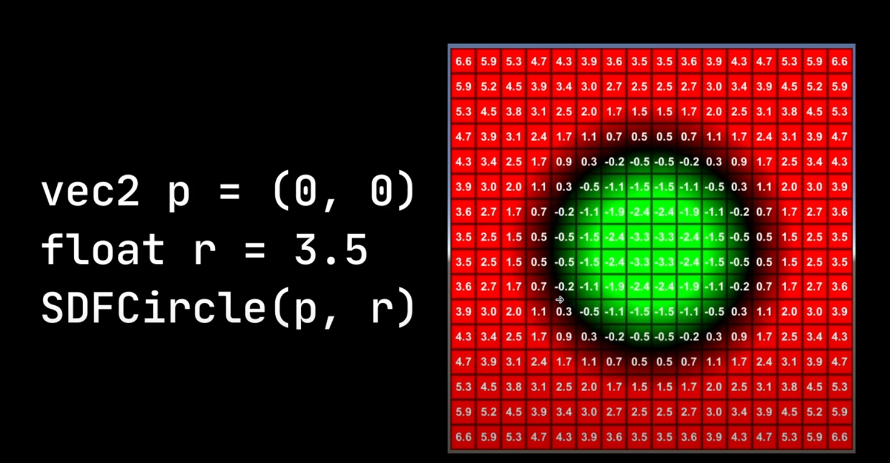

# Scene Reconstruction

!!! note

    start on: Aug 23, 2023

## MVS

- Current MVS pipeline for 3D reconstruction (2 stages)
    - Estimating the **depth map** for each image based on MVS
    - Performing **depth fusion** to obtain the final reconstruction result

> MVS downstream application
>
> - novel view synthesis

## Signed distance field

- signed distance from the edge of a shape
    - inside shape: negative
    - outside shape: positive
    - exactly on the shape: 0

## Marching Cube

> - [游戏编程挑战：生成无边的水下世界 体绘制算法 | Coding Adventure: Marching Cubes](https://www.bilibili.com/video/BV1yJ411r73v/)

## Useful Links

- [Camera Sensor Size](https://designreviews.com/digital-camera-sensor-size-chart/)