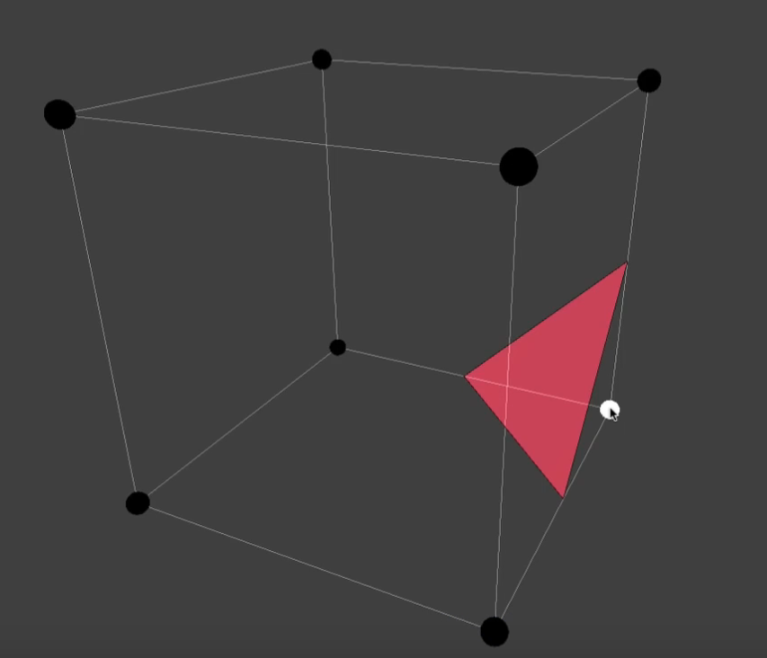

# Scene

!!! note

    start on: Aug 23, 2023

## Multi View Stereo

- Current MVS pipeline for 3D reconstruction (2 stages)
    - Estimating the **depth map** for each image based on MVS
    - Performing **depth fusion** to obtain the final reconstruction result

> MVS downstream application
>
> - novel view synthesis

## Incremental & global SFM

- **Incremental SFM**
    - 首先从一张或几张图像中恢复出初始的三维结构和摄像机参数。然后，每次引入一张新图像时，系统会将该图像与先前已恢复的模型进行比较，计算新图像中特征点与已知三维点的对应关系，并使用这些对应关系来优化摄像机参数和三维点的位置。这个过程不断迭代，每次处理一张新图像，逐步完善场景模型。
    - Pros: 适用于处理大规模图像序列、能够实时地更新模型
    - Cons: 每次迭代只考虑局部信息，可能会导致积累误差

- **Global SFM**
    - 同时考虑整个图像序列，系统会在整个图像序列中寻找共同的特征点并且同时优化所有的摄像机参数和三维点位置，以最大程度地减小整个场景模型的重投影误差。这种方法通常使用大规模非线性优化算法来解决
    - Pros: 可以更准确地建立整个场景的三维模型，因为它考虑了所有的图像和特征点信息，从而减小了累积误差的影响
    - Cons: 需要处理整个图像序列，全局式结构光通常计算复杂度较高，可能不适用于实时应用或大规模场景

## Signed distance field

- signed distance from the edge of a shape
    - inside shape: negative
    - outside shape: positive
    - exactly on the shape: 0

## Marching Cube

> - [游戏编程挑战：生成无边的水下世界 体绘制算法 | Coding Adventure: Marching Cubes](https://www.bilibili.com/video/BV1yJ411r73v/)

使用 3D 空间中的一个点作为输入， 随后返回一个值

$$
f(x,y,z) \to v
$$

假设在空间中的某个区域内，我们可以使用函数 $f$ 等间距的采样一些点

不妨设函数 $f$ 的最大值为 $16$，最小值为 $-32$，如果存在一个表面阈值 $sf$，当表面阈值从 $-32$ 增长到 $16$ 时，均匀采样点就会逐渐消失（视频 0:45）

我们可以认为消失的点是空白的空间，而大于等于表面阈值的点，则处于形体的表面或者内部

如果把这个问题简化到一个立方体内部，如果白色的点位于物体内部，它就被激活，这样我们就得到了一个三角面片

## Useful Links

- [Camera Sensor Size](https://designreviews.com/digital-camera-sensor-size-chart/)