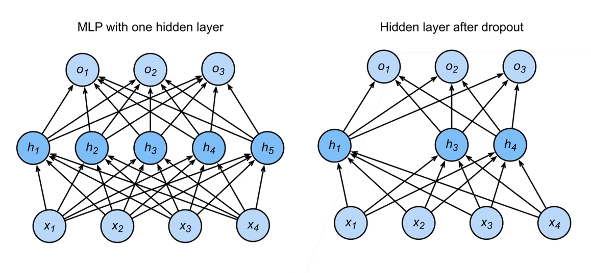

# Concepts in Deep Learning

## 梯度

我们可以连结一个多元函数对其所有变量的偏导数, 以得到该函数的梯度 (gradient) 向量。具体而言, 设函数 $f: \mathbb{R}^n \rightarrow \mathbb{R}$ 的输入是 $一$ 个 $n$ 维向量 $\mathbf{x}=\left[x_1, x_2, \ldots, x_n\right]^{\top}$, 并且输出是一个标量。函数 $f(\mathbf{x})$ 相对于 $\mathbf{x}$ 的梯度是一个包含 $n$ 个偏导数的向量:

$$
\nabla_{\mathbf{x}} f(\mathbf{x})=\left[\frac{\partial f(\mathbf{x})}{\partial x_1}, \frac{\partial f(\mathbf{x})}{\partial x_2}, \ldots, \frac{\partial f(\mathbf{x})}{\partial x_n}\right]^{\top}
$$

其中 $\nabla_{\mathbf{x}} f(\mathbf{x})$ 通常在没有歧义时被 $\nabla f(\mathbf{x})$ 取代。

假设 $\mathrm{x}$ 为 $n$ 维向量, 在微分多元函数时经常使用以下规则:

- 对于所有 $\mathbf{A} \in \mathbb{R}^{m \times n}$, 都有 $\nabla_{\mathbf{x}} \mathbf{A} \mathbf{x}=\mathbf{A}^{\top}$
- 对于所有 $\mathbf{A} \in \mathbb{R}^{n \times m}$, 都有 $\nabla_{\mathbf{x}} \mathbf{x}^{\top} \mathbf{A}=\mathbf{A}$
- 对于所有 $\mathbf{A} \in \mathbb{R}^{n \times n}$, 都有 $\nabla_{\mathbf{x}} \mathbf{x}^{\top} \mathbf{A} \mathbf{x}=\left(\mathbf{A}+\mathbf{A}^{\top}\right) \mathbf{x}$
- $\nabla_{\mathbf{x}}\|\mathbf{x}\|^2=\nabla_{\mathbf{x}} \mathbf{x}^{\top} \mathbf{x}=2 \mathbf{x}$  ([P.S. Vector derivation of $x^Tx$](https://math.stackexchange.com/questions/132415/vector-derivation-of-xtx))

同样, 对于任何矩阵 $\mathbf{X}$, 都有 $\nabla_{\mathbf{X}}\|\mathbf{X}\|_F^2=2 \mathbf{X}$ 。

## 线性模型

### 线性模型的实例

考虑一个房屋的价格的线性假设 [P.S. 指目标（房屋价格）可以表示为特征（面积和房龄）的加权和] 

$$
\text { price }=w_{\text {area }} \cdot \text { area }+w_{\text {age }} \cdot \text { age }+b
$$

- 上式中的 $w_{\text {area }}$ 和 $w_{\text {age }}$ 称为权重（weight），权重决定了每个特征对我们预测值的影响。 
- $b$ 称为偏置（bias）、偏移量（offset） 或截距 (intercept)。 偏置是指当所有特征都取值为 $0$ 时, 预测值应该为多少。
  - 即使现实中不会有任何房子的面积是 0 或房龄正好是 0 年, 我们仍然需要偏置项。如果没有偏置项, 我们模型的表达能力将受到限制。
- 严格来说，上式是输入特征的一个仿射变换 (affine transformation）。仿射变换的特点是通过加权和对特征进行线性变换（linear transformation），并通过偏置项来进行平移 (translation)。

### 抽象的线性模型

对于 $n$ 维输入 $[x_1,x_2...x_n]^T$，线性模型有 $n$ 维权重 $[w_1,w_2...w_n]^T$ 和一个标量偏差 $b$

当输入包含 $d$ 个特征时，预测结果 $\hat{y}$ 可以表示为

$$
\hat{y}=w_1 x_1+\ldots+w_d x_d+b
$$

[向量版本] 将所有特征放到向量 $\mathbf{x} \in \mathbb{R}^d$ 中, 并将所有权重放到向量 $\mathbf{w} \in \mathbb{R}^d$ 中, 我们可以用点积形式来简洁地表达模型：

$$
\hat{y}=\mathbf{w}^{\top} \mathbf{x}+b .
$$

> 下面将通过这个例子描述概念

## 损失函数

- 衡量预估质量的指标，越小越好
- 通过比较真实值和预估值的方式实现，例如房屋的实际售价和估价
- e.g. 假设 $y$ 是真实值，$\hat{y}$ 是估计值，我们可以比较

$$
\ell(y, \hat{y})=\frac{1}{2}(y-\hat{y})^2
$$

>- 这就是平方损失
>
>- 常数 $\frac{1}{2}$ 不会带来本质的差别，但这样在形式上稍微简单一些 （因为当我们对损失函数求导后常数系数为1）

## 训练数据

- 收集一些数据点来决定参数值（权重 $w$ 和偏差 $b$）
- 这就是训练数据，通常越多越好
- 假设我们有 $n$ 个样本，记 $X=[x_1,x_2...x_n]^T, y=[y_1,y_2...y_n]^T$ 

## 参数学习

- 训练损失：就是对每一个数据上的损失求一个均值

$$
\ell(X,y,w,b)=\frac{1}{2}\times \frac{1}{n}\sum_{i=1}^{n}(y_i-\hat{y_i})^2 = \frac{1}{2n}\sum_{i=1}^{n}(y_i-<x_i,w>-b)^2
$$

写成向量形式为

$$
\frac{1}{2n}||y-Xw-b||^2
$$

- 训练目标：找到 $w,b$ ，使得 $\ell(X,y,w,b)$ 是最小的，可以写成如下形式

$$
w^*,b^*=\arg{\min_{w,b}{\ell(X,y,w,b)}}
$$

线性模型是存在解析解的，我们可以直接求出线性模型的最优解。在求解时，为了方便起见，我们将偏差 $b$ 加入权重 $w$ 的矩阵中，使其成为一个特征，对于矩阵 $X$，就添加一个全 $1$ 的列来保证二者相乘是有效的，于是

$$
\ell(X,y,w,b)=\ell(X,y,w') = \frac{1}{2n}||y-Xw||^2
$$

由于这是一个凸函数，最小值在梯度为 $0$ 时取到，因此令

$$
\frac{\partial{\ell(X,y,w)}}{\partial{w}}=\frac{1}{n}(y-Xw)^TX= 0
$$

解上式有

$$
\displaylines{\frac{1}{n}(y-Xw)^TX=0\\
y^TX-(w^TX^T)X=0 \\
w^T=y^TX(X^TX)^{-1} \\}
$$

于是

$$
\begin{aligned}
 w &= [y^TX(X^TX)^{-1}]^T &\\
 &=[(y^TX)(X^TX)^{-1}]^T&\\
 &=[(X^TX)^{-1}]^T(y^TX)^T&\\
 &=[(X^TX)^{T}]^{-1}(y^TX)^T&\\
 &=(X^TX)^{-1}(X^Ty)&
\end{aligned}
$$

## 基本优化方法

如果不采用解析做法，或者模型无法使用解析方法求解的时候，需要使用优化的方法来求解

### 梯度下降

在求解参数的时候，对于参数 $w$，对其赋予一个随机初值 $w_0$，在规定的步数 $t = t_1,t_2,t_3,...,t_n$ 内，更新 $w_{t_i}$ 的值。并且，$w_{t}$ 和 $w_{t-1}$ 之间有如下关系

$$
w_t = w_{t-1} - \eta\frac{\partial{\ell}}{\partial{w_{t-1}}}
$$

- $\eta$ 是学习率，也就是每一次梯度下降的步长，它是一个超参数
  - 注意：计算梯度的开销是很大的，在选择学习率时要选择一个合适的值

> 超参数：人为指定的值

### 小批量随机梯度下降

由于计算全部样本的梯度开销还是太大，所以采用随机采样 $b$ 个样本 $i_1,i_2,...,i_b$  的方法来近似损失，$b$ 的值叫做 batch size，它也是一个超参数，小批量随机采样的损失为

$$
\frac{1}{b}\sum_{i\in I_b}\ell(x_i,y_i,w)
$$

## 多层感知机 MLP

- 也被称作 **前馈神经网络**（feedforward neural network）
- [参考](https://zh.d2l.ai/chapter_multilayer-perceptrons/mlp.html)

我们可以通过在网络中加入一个或多个隐藏层来克服线性模型的限制, 使其能处理更普遍的函数关系类型。要做到这一点，最简单的方法是将许多全连接层堆叠在一起。每一层都输出到上面的层，直到生成最后的输出。我们可以把前 $L-1$ 层看作表示，把最后一层看作线性预测器。这种 架构通常称为**多层感知机**（multilayer perceptron），通常缩写为 MLP。

## 模型选择

- 训练误差：模型在训练数据上的误差
- 泛化误差：模型在新数据上的误差
- 验证数据集：评估模型好坏的数据集
  - 验证数据集可以用来调整超参数
  - 很多时候为了方便在代码中直接都叫 `test_data` 但实际上它是验证数据集
- 测试数据集：只用一次的数据集
  - 未来的考试
  - 出价房子的实际成交价
- $K$ 则交叉验证：在训练数据没有那么多的时候，使用它的平均误差判断超参数的好坏

## 过拟合和欠拟合

- 模型容量：拟合各种函数的能力
  - 低容量的模型难以拟合训练数据
  - 高容量的模型可以记住所有的训练数据		
- 估计模型容量
  - 难以在不同种类的算法之间比较
  - 模型容量要匹配训练复杂度
  - 给定一个模型种类，将有两个主要因素
    - 参数的个数
    - 参数值的选择范围

### 权重衰退 Weight Decay

#### 使用均方范数作为硬性限制

- 通过限制参数值的选择范围来控制模型容量 

$$
\min \ell(\mathbf{w}, b)\text{ subject to }\|\mathbf{w}\|^2 \leq \theta
$$

- 其中 $\ell$ 为损失函数，$\mathbf{w}, b$ 为参数，在最小化 loss 的时候加入一个限制，使得权重 $\mathbf{w}$ 的 $L_2$ norm 小于 $\theta$ 
- 通常不限制偏移 $b$ （但是限不限制都差不多）
- 小的 $\theta$ 意味着更强的正则项（对 $\mathbf{w}$ 值的限制强）

#### 使用均方范数作为柔性限制

- 对每个 $\theta$, 都可以找到 $\lambda$ 使得之前的目标函数（使用均方范数作为硬性限制）等价于下面的公式
  - 可以通过拉格朗日乘子来证明
  - 后面的项可以被成为惩罚项 (penalty)

$$
\min \ell(\mathbf{w}, b)+\frac{\lambda}{2}\|\mathbf{w}\|^2
$$

- 超参数 $\lambda$ 控制了正则项的重要程度
  - $\lambda=0$ ：无作用
  - $\lambda \rightarrow \infty, \mathbf{w}^* \rightarrow \mathbf{0}$

#### 参数更新法则

- 计算梯度

$$
\frac{\partial}{\partial \mathbf{w}}\left(\ell(\mathbf{w}, b)+\frac{\lambda}{2}\|\mathbf{w}\|^2\right)=\frac{\partial \ell(\mathbf{w}, b)}{\partial \mathbf{w}}+\lambda \mathbf{w}
$$

- 时间 $t$ 更新参数

$$
\begin{aligned}
 \mathbf{w}_{t+1} &= \mathbf{w}_{t+1} + \eta\frac{\partial}{\partial \mathbf{w}_t}(\ell(\mathbf{w}, b)+\frac{\lambda}{2}\|\mathbf{w}\|^2) &\\
 &=(1-\eta \lambda) \mathbf{w}_t-\eta \frac{\partial \ell\left(\mathbf{w}_t, b_t\right)}{\partial \mathbf{w}_t}&\\
\end{aligned}
$$

- 通常 $\eta \lambda<1$, 在深度学习中通常叫做权重衰退
- 权重衰退通过 $L_2$ 正则项使得模型参数不会过大，从而控制模型复杂度
- 正则项权重是控制模型复杂度的超参数

### 丢弃法 Dropout

- 一个好的模型需要对输入的数据的扰动健壮
- 使用有噪音的数据等价于 Tikhonov 正则（随机噪音可以防止过拟合）
- 丢弃法：在层之间加入噪音
  - 将一些输出项随机置为 $0$ 来控制模型的复杂度
  - 丢弃概率是控制模型复杂度的超参数

####  无偏差的加入噪音

- 对 $x$ 加入噪音得到 $x'$ ，我们希望

$$
E(x')=x
$$

- 丢弃法对每个元素进行如下扰动

$$
x_i^{\prime}= \begin{cases}0 & \text { with probablity } p \\ \frac{x_i}{1-p} & \text { otherise }\end{cases}
$$

#### 使用丢弃法

- 训练时的丢弃法：通常将丢弃法用在训练时隐藏全连接层的输出上
- 常作用在 MLP 的隐藏层输出上

$$
\begin{aligned}
\mathbf{h} & =\sigma\left(\mathbf{W}_1 \mathbf{x}+\mathbf{b}_1\right) \\
\mathbf{h}^{\prime} & =\operatorname{dropout}(\mathbf{h}) \\
\mathbf{o} & =\mathbf{W}_2 \mathbf{h}^{\prime}+\mathbf{b}_2 \\
\mathbf{y} & =\operatorname{softmax}(\mathbf{o})
\end{aligned}
$$

- 推理中的丢弃法：直接返回输入，等价于不使用 dropout

## 数值稳定性

### 网络的梯度

- 考虑如下的 $d$ 层神经网络

$$
h^t = f_t(h^{t-1}) \quad \text{and} \quad y=\ell \circ f_d \circ \ldots \circ f_1(\mathbf{x})
$$

- 计算损失 $\ell$ 关于参数 $\textbf{W}_t$ 的梯度，根据链式法则有
  - 所有的中间项都是向量对向量求导，得到的结果是矩阵，在这个过程中，需要做大量的矩阵乘法
  - 这就带来了两个常见的数值稳定性问题：梯度爆炸和梯度消失

$$
\frac{\partial \ell}{\partial \mathbf{W}^t}=\frac{\partial \ell}{\partial \mathbf{h}^d} \frac{\partial \mathbf{h}^d}{\partial \mathbf{h}^{d-1}} \ldots \frac{\partial \mathbf{h}^{t+1}}{\partial \mathbf{h}^t} \frac{\partial \mathbf{h}^t}{\partial \mathbf{W}^t}
$$

#### MLP 的例子

对于 MLP （省略偏置项）

- $f_t\left(\mathbf{h}^{t-1}\right)=\sigma\left(\mathbf{W}^t \mathbf{h}^{t-1}\right) \quad$ $\sigma$  是激活函数
- $\frac{\partial \mathbf{h}^t}{\partial \mathbf{h}^{t-1}}=\operatorname{diag}\left(\sigma^{\prime}\left(\mathbf{W}^t \mathbf{h}^{t-1}\right)\right)\left(W^t\right)^T \quad \sigma^{\prime}$ 是 $\sigma$ 的导数函数

所以有

$$
\begin{equation}
\prod_{i=t}^{d-1} \frac{\partial \mathbf{h}^{i+1}}{\partial \mathbf{h}^i}=\prod_{i=t}^{d-1} \operatorname{diag}\left(\sigma^{\prime}\left(\mathbf{W}^i \mathbf{h}^{i-1}\right)\right)\left(W^i\right)^T
\end{equation}
$$

#### 梯度爆炸

- 如果使用 ReLU 作为上式的激活函数，有

$$
\sigma(x)=\max (0, x) \quad \text { and } \quad \sigma^{\prime}(x)=\left\{\begin{array}{lc}
1 & \text { if } x>0 \\
0 & \text { otherwise }
\end{array}\right.
$$

$\prod_{i=t}^{d-1} \frac{\partial \mathbf{h}^{i+1}}{\partial \mathbf{h}^i}=\prod_{i=t}^{d-1} \operatorname{diag}\left(\sigma^{\prime}\left(\mathbf{W}^i \mathbf{h}^{i-1}\right)\right)\left(W^i\right)^T$ 中的一些元素会来自于 $\prod_{i=t}^{d-1}\left(W^i\right)^T$ ，如果 $d-t$ 很大，值将会很大

梯度爆炸带来的问题

- 梯度超值域：常用的 16bit 精度的浮点数范围仅在（ $6\mathbf{e}^{-5} \sim 6\mathbf{e}^4$ ）之间
- 模型对学习率敏感，在梯度很大时
  - $\text{learning rate} \uparrow \quad \longrightarrow\quad w \uparrow \quad \longrightarrow \quad \nabla \uparrow$
  - $\text{learning rate} \downarrow \quad \longrightarrow \quad \text{训练无进展}$

#### 梯度消失

- 如果使用 sigmoid 作为上式的激活函数，有

$$
\sigma(x) = \frac{1}{1+e^{-x}} \quad \sigma'(x)=\sigma(x)(1-\sigma(x)) 
$$
当输入的值很大时，梯度会很小

梯度消失带来的问题

- $\nabla \to 0 \quad \longrightarrow \quad \text{训练无进展}$
- 底部的层梯度较小，无法让神经网络更深

### 权重初始化

- 在合理值区间里随机初始参数
- 训练开始的时候更容易有数值不稳定
  - 远离最优解的地方损失函数表面可能 很复杂
  - 最优解附近表面会比较平
- 使用 $\mathcal{N}(0,0.01)$ 来初始可能对小网络没问题, 但不能保证深度神经网络

## Latent Space & Code

- latent code: 为了更好的对数据进行分类或生成，需要对数据的特征进行表示，但是数据有很多特征，这些特征之间相互关联，耦合性较高，导致模型很难弄清楚它们之间的关联，使得学习效率低下，因此需要寻找到这些表面特征之下隐藏的深层次的关系，将这些关系进行解耦，得到的隐藏特征，即 latent code
- latent space: 由 latent code 组成的空间

## 前向和反向传播

- 前向传播（forward propagation或 forward pass） 指的是：**按顺序（从输入层到输出层）计算和存储神经网络中每层的结果**

- 反向传播（backward propagation或 backpropagation）指的是**计算神经网络参数梯度的方法**。简言之, 该方法根据微积分中的链式规则, 按相反 的顺序从输出层到输入层遍历网络。该算法存储了计算某些参数梯度时所需的任何中间变量（偏导数）。假设我们有函数 $Y=f(X)$ 和 $Z =g(Y)$ , 其中输入和输出 $X, Y, Z$ 是任意形状的张量。利用链式法则, 我们可以计算 $Z$ 关于 $X$ 的导数

$$
\frac{\partial {Z}}{\partial {X}}=\operatorname{prod}\left(\frac{\partial {Z}}{\partial {Y}}, \frac{\partial {Y}}{\partial {X}}\right)
$$

在这里，我们使用 $\operatorname{prod}$ 运算符在执行必要的操作（如换位和交换输入位置）后将其参数相乘。对于向量，这很简单，它只是矩阵-矩阵乘法。对于高维张量，我们使用适当的对应项。运算符 $\operatorname{prod}$ 指代了所有的这些符号。

# Concept Links

- [nn.Module 类与前向传播函数 forward 的理解](https://www.cnblogs.com/luckyplj/p/13378293.html)
